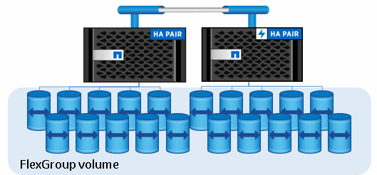

= 있습니다
:allow-uri-read: 
:icons: font
:imagesdir: ../media/

[role="lead"]
ONTAP에서 버킷의 기본 아키텍처는 FlexGroup 볼륨입니다. 이는 여러 개의 구성 멤버 볼륨으로 이루어진 단일 네임스페이스이지만 단일 볼륨으로 관리됩니다.

버킷은 기본 하드웨어의 물리적 최대값에 의해서만 제한되며, 아키텍처 최대값은 더 높아질 수 있습니다. 버킷은 FlexGroup의 탄력적인 크기 조정을 활용하여 공간이 부족한 경우 FlexGroup 볼륨의 구성요소를 자동으로 늘릴 수 있습니다. FlexGroup 볼륨당 1,000개의 버킷 또는 FlexGroup 볼륨 용량의 1/3의 제한이 있습니다(버킷 단위의 데이터 증가를 고려함).

[NOTE]
====
S3 버킷을 포함하는 FlexGroup 볼륨에는 NAS 또는 SAN 프로토콜 액세스가 허용되지 않습니다.

====
버킷에 대한 액세스는 승인된 사용자 및 클라이언트 애플리케이션을 통해 제공됩니다.

image::../media/s3-svm-layout.png[S3 SVM 버킷 액세스]
