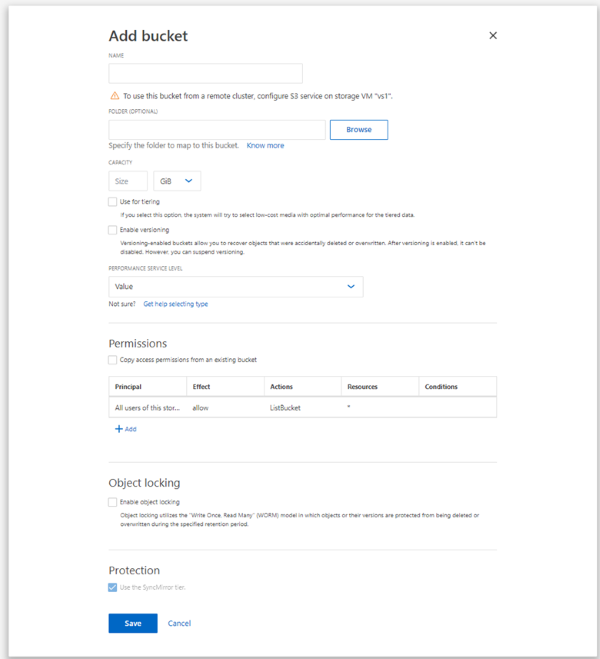

= MetroCluster 구성의 경우 미러링된 또는 미러링되지 않은 애그리게이트에 버킷을 생성합니다
:allow-uri-read: 
:icons: font
:imagesdir: ../media/

[role="lead"]
ONTAP 9.14.1부터 MetroCluster FC 및 IP 구성의 미러링 또는 미러링되지 않은 애그리게이트에 버킷을 프로비저닝할 수 있습니다.

.이 작업에 대해
* 기본적으로 버킷은 미러링된 애그리게이트에서 프로비저닝됩니다.
* 에 설명된 것과 동일한 프로비저닝 지침을 따릅니다 link:create-bucket-task.html["버킷을 만듭니다"] MetroCluster 환경에서 버킷 생성에 적용됩니다.
* 다음 S3 오브젝트 스토리지 기능은 MetroCluster 환경에서 * 지원되지 않음 *.
+
** S3 SnapMirror
** S3 버킷 라이프사이클 관리
** Compliance * 모드에서 S3 오브젝트 잠금
+

NOTE: 거버넌스 * 모드에서 S3 오브젝트 잠금이 지원됩니다.

** 로컬 FabricPool 계층화

.시작하기 전에
S3 서버를 포함하는 SVM이 이미 존재해야 합니다.

== 버킷을 생성하는 프로세스

[role="tabbed-block"]
====
.CLI를 참조하십시오
--
. Aggregate 및 FlexGroup 구성 요소를 직접 선택하려면 권한 수준을 Advanced(고급)로 설정하십시오. 그렇지 않으면 admin 권한 수준이 Advanced(고급)로 설정됩니다
. 버킷 생성:
+
`vserver object-store-server bucket create -vserver <svm_name> -bucket <bucket_name> [-size integer[KB|MB|GB|TB|PB]] [-use-mirrored-aggregates true/false]`

+
를 설정합니다 `-use-mirrored-aggregates` 옵션을 로 설정합니다 `true` 또는 `false` 미러링된 애그리게이트를 사용할지, 아니면 미러링되지 않은 애그리게이트를 사용할지에 따라 다릅니다.

+

NOTE: 기본적으로 은(는) 입니다 `-use-mirrored-aggregates` 옵션이 로 설정되어 있습니다 `true`.

+
** SVM 이름은 데이터 SVM이어야 합니다.
** 옵션을 지정하지 않으면 ONTAP에서 5GB 버킷이 생성되고 서비스 수준은 시스템에서 사용 가능한 가장 높은 수준으로 설정됩니다.
** ONTAP에서 성능 또는 사용량을 기준으로 버킷을 생성하려면 다음 옵션 중 하나를 사용하십시오.
+
*** 서비스 레벨
+
가치, 성능, 익스트림 등의 가치 중 하나로 스토리지 서비스 수준 옵션을 포함시키십시오.

*** 계층화
+
사용된 용량 계층 TRUE 옵션을 포함합니다.

** 기본 FlexGroup 볼륨을 생성할 애그리게이트를 지정하려면 다음 옵션을 사용하십시오.
+
*** '-aggr-list' 매개 변수는 FlexGroup 볼륨 구성요소에 사용할 애그리게이트 목록을 지정합니다.
+
목록의 각 항목은 지정된 애그리게이트에 구성요소를 생성합니다. Aggregate를 여러 번 지정하여 Aggregate에 여러 구성요소를 생성할 수 있습니다.

+
FlexGroup 볼륨 전체에서 일관된 성능을 위해서는 모든 애그리게이트에서 동일한 디스크 유형과 RAID 그룹 구성을 사용해야 합니다.

*** '-aggr-list-multiplier' 매개 변수는 FlexGroup 볼륨을 생성할 때 '-aggr-list' 매개 변수로 나열된 애그리게이트를 반복하는 횟수를 지정합니다.
+
'-aggr-list-multiplier' 파라미터의 기본값은 4이다.

. 필요한 경우 QoS 정책 그룹을 추가합니다.
+
'vserver object-store-server bucket modify -bucket_bucket_name_-qos-policy-group_qos_policy_group_'

. 버킷 생성 확인:
+
'vserver object-store-server bucket show[-instance]'

.예
다음 예에서는 미러링된 애그리게이트에 1TB 크기의 SVM VS1에 대한 버킷을 생성합니다.

[listing]
----
cluster-1::*> vserver object-store-server bucket create -vserver svm1.example.com -bucket testbucket  -size 1TB -use-mirrored-aggregates true
----
--
.시스템 관리자
--
. S3 지원 스토리지 VM에 새 버킷을 추가합니다.
+
.. 스토리지 > 버킷 * 을 클릭한 다음 * 추가 * 를 클릭합니다.
.. 이름을 입력하고 스토리지 VM을 선택한 다음 크기를 입력합니다.
+
기본적으로 버킷은 미러링된 애그리게이트에서 프로비저닝됩니다. 미러링되지 않은 Aggregate에 버킷을 생성하려면 * More Options * 를 선택하고 다음 이미지와 같이 * Protection * 아래에서 * Use the SyncMirror tier * 확인란의 선택을 취소합니다.

+

+
*** 이 지점에서 * Save * (저장 *)를 클릭하면 다음 기본 설정으로 버킷이 생성됩니다.
+
**** 그룹 정책이 이미 적용되어 있지 않으면 버킷에 대한 액세스 권한이 사용자에게 부여되지 않습니다.
+

NOTE: 오브젝트 저장소에 대한 무제한 액세스 권한이 있으므로 S3 루트 사용자를 사용하여 ONTAP 오브젝트 스토리지를 관리하고 권한을 공유해서는 안 됩니다. 대신 할당한 관리 권한이 있는 사용자 또는 그룹을 만듭니다.

**** 시스템에서 가장 높은 수준의 서비스 품질(성능) 수준입니다.

*** bucket을 구성할 때 * 추가 옵션 * 을 클릭하여 사용자 권한 및 성능 수준을 구성하거나 나중에 이러한 설정을 수정할 수 있습니다.
+
**** 권한을 구성하려면 * 추가 옵션 * 을 사용하기 전에 사용자 및 그룹을 이미 만들어야 합니다.
**** FabricPool 계층화에 S3 오브젝트 저장소를 사용하려는 경우 성능 서비스 수준이 아닌 * 계층화에 사용 * (계층 데이터에 최적의 성능을 제공하는 저비용 미디어 사용)을 선택하는 것이 좋습니다.

. S3 클라이언트 애플리케이션 – 다른 ONTAP 시스템 또는 외부 타사 애플리케이션 – 다음을 입력하여 새 버킷에 대한 액세스를 확인합니다.
+
** S3 서버 CA 인증서입니다.
** 사용자의 액세스 키 및 암호 키입니다.
** S3 서버 FQDN 이름 및 버킷 이름입니다.

--
====