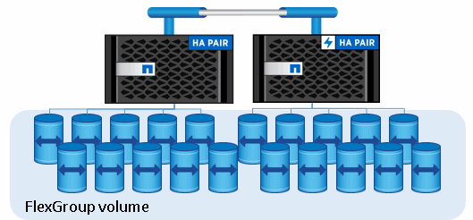
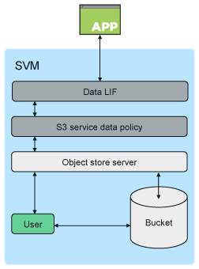

= ONTAP S3 아키텍처 및 사용 사례
:allow-uri-read: 
:icons: font
:imagesdir: ../media/

[role="lead"]
ONTAP에서 버킷의 기본 아키텍처는 FlexGroup 볼륨입니다. 이는 여러 개의 구성 멤버 볼륨으로 이루어진 단일 네임스페이스이지만 단일 볼륨으로 관리됩니다.

버킷은 기본 하드웨어의 물리적 최대값에 의해서만 제한되며, 아키텍처 최대값은 더 높아질 수 있습니다. 버킷은 FlexGroup의 탄력적인 크기 조정을 활용하여 공간이 부족한 경우 FlexGroup 볼륨의 구성요소를 자동으로 늘릴 수 있습니다. FlexGroup 볼륨당 1,000개의 버킷 또는 FlexGroup 볼륨 용량의 1/3의 제한이 있습니다(버킷 단위의 데이터 증가를 고려함).

[NOTE]
====
S3 버킷을 포함하는 FlexGroup 볼륨에는 NAS 또는 SAN 프로토콜 액세스가 허용되지 않습니다.

====
버킷에 대한 액세스는 승인된 사용자 및 클라이언트 애플리케이션을 통해 제공됩니다.

ONTAP S3 서비스에 대한 클라이언트 액세스에는 다음과 같은 세 가지 주요 사용 사례가 있습니다.

* ONTAP S3를 원격 FabricPool 용량(클라우드) 계층으로 사용하는 ONTAP 시스템의 경우
+
용량 계층(_cold_data)을 포함하는 S3 서버 및 버킷이 성능 계층(_hot_data)과 다른 클러스터에 있습니다.

* ONTAP S3를 로컬 FabricPool 계층으로 사용하는 ONTAP 시스템의 경우
+
용량 계층을 포함하는 S3 서버와 버킷이 성능 계층과 동일한 클러스터에 있지만 다른 HA 쌍에 있습니다.

* 외부 S3 클라이언트 애플리케이션
+
ONTAP S3는 비NetApp 시스템에서 실행되는 S3 클라이언트 애플리케이션을 지원합니다.

HTTPS를 사용하여 ONTAP S3 버킷에 대한 액세스를 제공하는 모범 사례입니다. HTTPS가 활성화된 경우 SSL/TLS와의 올바른 통합을 위해 보안 인증서가 필요합니다. 그런 다음 ONTAP S3을 사용하여 사용자를 인증하고 ONTAP S3 내의 작업에 대한 사용자의 액세스 권한을 사용자에게 부여하는 클라이언트 사용자 '' 액세스 및 비밀 키가 필요합니다. 또한 클라이언트 응용 프로그램은 서버를 인증하고 클라이언트와 서버 간의 보안 연결을 생성할 수 있도록 루트 CA 인증서(ONTAP S3 서버의 서명된 인증서)에 대한 액세스 권한이 있어야 합니다.

사용자는 S3 기반 SVM 내에서 생성되고, 액세스 권한을 버킷 또는 SVM 레벨에서 제어할 수 있습니다. 즉, SVM 내에서 하나 이상의 버킷에 대한 액세스를 허용할 수 있습니다.

HTTPS는 ONTAP S3 서버에서 기본적으로 활성화됩니다. 클라이언트 액세스에 대해 HTTPS를 비활성화하고 HTTP를 활성화할 수 있으며, 이 경우 CA 인증서를 사용한 인증이 필요하지 않습니다. 그러나 HTTP가 활성화되고 HTTPS가 비활성화되면 ONTAP S3 서버와의 모든 통신이 일반 텍스트로 네트워크를 통해 전송됩니다.

자세한 내용은 을 참조하십시오 https://www.netapp.com/pdf.html?item=/media/17219-tr4814pdf.pdf["기술 보고서: ONTAP 모범 사례의 S3"]

.관련 정보
link:../flexgroup/index.html["FlexGroup 볼륨 관리"]
