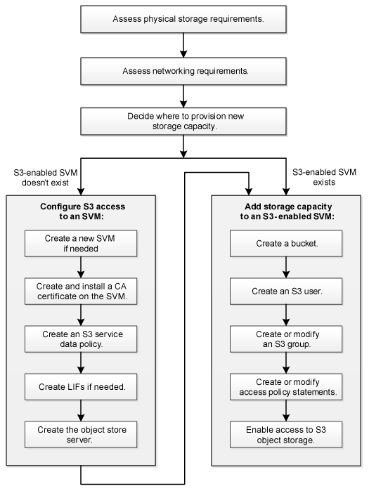

= S3 구성 워크플로우
:allow-uri-read: 
:icons: font
:imagesdir: ../media/

[role="lead"]
S3 구성에는 물리적 스토리지 및 네트워킹 요구사항을 평가한 다음, 특정 목적에 맞는 워크플로우 선택, 즉 새 SVM 또는 기존 SVM에 대한 S3 액세스 구성, 또는 이미 S3 액세스용으로 완전히 구성된 기존 SVM에 버킷 및 사용자 추가 등이 포함됩니다.

