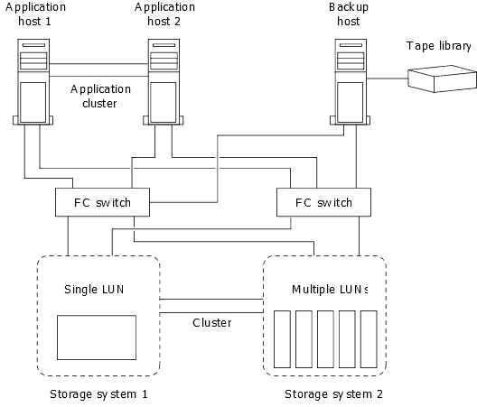

= 호스트 백업 시스템을 운영 스토리지 시스템에 연결하는 방법
:allow-uri-read: 
:icons: font
:imagesdir: ../media/

[role="lead"]
별도의 백업 호스트를 통해 SAN 시스템을 테이프로 백업하여 애플리케이션 호스트의 성능 저하를 방지할 수 있습니다.

백업을 위해 SAN 및 NAS 데이터를 별도로 유지해야 합니다. 아래 그림은 운영 스토리지 시스템에 대한 호스트 백업 시스템의 권장 물리적 구성을 보여 줍니다. 볼륨을 SAN 전용으로 구성해야 합니다. LUN은 단일 볼륨으로 제한하거나 여러 볼륨 또는 스토리지 시스템에 분산할 수 있습니다.

호스트의 볼륨은 스토리지 시스템에서 매핑된 단일 LUN 또는 HP-UX 시스템의 VxVM과 같은 볼륨 관리자를 사용하여 여러 LUN으로 구성될 수 있습니다.
