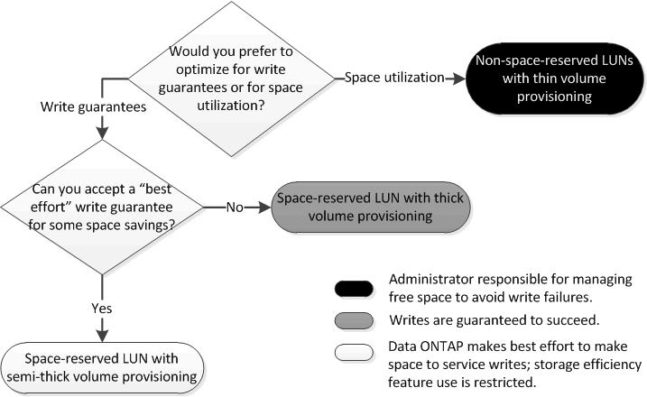

= 환경에 맞는 올바른 볼륨 및 LUN 구성 조합을 결정합니다
:allow-uri-read: 
:icons: font
:imagesdir: ../media/

[role="lead"]
환경에 대한 몇 가지 기본적인 질문에 답변하면 환경에 가장 적합한 FlexVol 볼륨 및 LUN 구성을 파악하는 데 도움이 됩니다.

LUN 및 볼륨 구성을 최적화하여 스토리지 활용률을 극대화하거나 쓰기 보장을 극대화할 수 있습니다. 스토리지 활용률의 요구사항과 여유 공간을 신속하게 모니터링 및 보충하는 기능을 기준으로 설치에 적합한 FlexVol 볼륨 및 LUN 볼륨을 결정해야 합니다.

[NOTE]
====
각 LUN에 대해 별도의 볼륨이 필요하지 않습니다.

====
.단계
. 다음 진단트리를 사용하여 환경에 가장 적합한 볼륨 및 LUN 구성 조합을 결정합니다.
+

