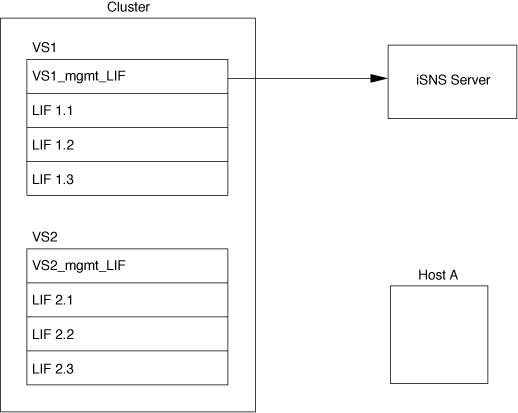
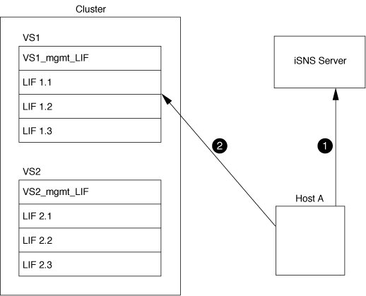

= iSNS(Internet Storage Name Service)
:allow-uri-read: 
:icons: font
:imagesdir: ../media/

[role="lead"]
iSNS(Internet Storage Name Service)는 TCP/IP 스토리지 네트워크에서 iSCSI 디바이스를 자동으로 검색하고 관리할 수 있도록 하는 프로토콜입니다. iSNS 서버는 IP 주소, iSCSI 노드 이름 IQN 및 포털 그룹을 포함하여 네트워크의 활성 iSCSI 장치에 대한 정보를 유지합니다.

타사 공급업체에서 iSNS 서버를 가져올 수 있습니다. 네트워크에 iSNS 서버가 구성되어 이니시에이터 및 타겟에 사용하도록 설정되어 있는 경우 SVM(스토리지 가상 머신)에 관리 LIF를 사용하여 iSNS 서버에 해당 SVM에 대한 모든 iSCSI LIF를 등록할 수 있습니다. 등록이 완료되면 iSCSI 이니시에이터가 iSNS 서버를 쿼리하여 해당 SVM에 대한 모든 LIF를 검색할 수 있습니다.

iSNS 서비스를 사용하려는 경우 iSNS(Internet Storage Name Service) 서버에 스토리지 가상 시스템(SVM)이 올바르게 등록되어 있는지 확인해야 합니다.

네트워크에 iSNS 서버가 없는 경우 호스트에 표시되도록 각 타겟을 수동으로 구성해야 합니다.

== iSNS 서버의 기능

iSNS 서버는 iSNS(Internet Storage Name Service) 프로토콜을 사용하여 IP 주소, iSCSI 노드 이름(IQN) 및 포털 그룹을 포함하여 네트워크의 활성 iSCSI 장치에 대한 정보를 유지합니다.

iSNS 프로토콜을 사용하면 IP 스토리지 네트워크에서 iSCSI 디바이스를 자동으로 검색하고 관리할 수 있습니다. iSCSI 이니시에이터는 iSNS 서버를 쿼리하여 iSCSI 타겟 디바이스를 검색할 수 있습니다.

NetApp은 iSNS 서버를 제공하거나 재판매하지 않습니다. NetApp에서 지원하는 공급업체로부터 이러한 서버를 받을 수 있습니다.

== SVM이 iSNS 서버와 상호 작용하는 방식

iSNS 서버는 SVM 관리 LIF를 통해 각 SVM(스토리지 가상 시스템)과 통신합니다. 관리 LIF는 특정 SVM을 위한 iSNS 서비스를 사용하여 모든 iSCSI 대상 노드 이름, 별칭 및 포털 정보를 등록합니다.

다음 예에서는 SVM ""VS1""이 SVM 관리 LIF ""VS1_mgmt_lif""를 사용하여 iSNS 서버에 등록합니다. iSNS 등록 중에 SVM은 SVM 관리 LIF를 통해 모든 iSCSI LIF를 iSNS 서버에 보냅니다. iSNS 등록이 완료되면 iSNS 서버에 ""VS1""에서 iSCSI를 지원하는 모든 LIF 목록이 있습니다. 클러스터에 SVM이 여러 개 포함된 경우 각 SVM은 iSNS 서버에 개별적으로 등록하여 iSNS 서비스를 사용해야 합니다.

다음 예에서는 iSNS 서버가 타겟과의 등록을 완료한 후 호스트 A가 1단계에서 설명한 대로 iSNS 서버를 통해 ""VS1""에 대한 모든 LIF를 검색할 수 있습니다. 호스트 A가 ""VS1""에 대한 LIF 검색을 완료한 후 호스트 A는 2단계에 표시된 ""VS1""에 있는 LIF와 연결을 설정할 수 있습니다. 호스트 A는 관리 LIF가 ""VS2"에 ""VS2""에 ""VS2""에 등록될 때까지 ""VS2""에 있는 LIF를 인식하지 못합니다.

그러나 인터페이스 액세스 목록을 정의하는 경우 호스트는 인터페이스 액세스 목록에 정의된 LIF만 사용하여 타겟에 액세스할 수 있습니다.

iSNS를 처음 구성한 후 SVM 구성 설정이 변경되면 ONTAP에서 iSNS 서버를 자동으로 업데이트합니다.

구성을 변경하는 시간과 ONTAP가 iSNS 서버에 업데이트를 보내는 시간 사이에 몇 분 정도 지연될 수 있습니다. iSNS 서버에서 iSNS 정보를 즉시 업데이트합니다. `vserver iscsi isns update`

== iSNS 관리 명령입니다

ONTAP는 iSNS 서비스를 관리하는 명령을 제공합니다.

|===

| 원하는 작업 | 이 명령 사용... 

 a| 
iSNS 서비스를 구성합니다
 a| 
'SVM iSCSI iSNS create'

 a| 
iSNS 서비스를 시작합니다
 a| 
가상 iSCSI iSNS 시작

 a| 
iSNS 서비스를 수정합니다
 a| 
'SVM iSCSI iSNS modify(iSCSI iSNS 수정)'

 a| 
iSNS 서비스 구성을 표시합니다
 a| 
SVM iSCSI iSNS show

 a| 
등록된 iSNS 정보를 강제로 업데이트합니다
 a| 
가상 iSCSI iSNS 업데이트

 a| 
iSNS 서비스를 중지합니다
 a| 
가상 iSCSI iSNS 중지

 a| 
iSNS 서비스를 제거합니다
 a| 
가상 iSCSI iSNS 삭제

 a| 
명령에 대한 man 페이지를 봅니다
 a| 
man_command name _

|===
자세한 내용은 각 명령에 대한 man 페이지를 참조하십시오.
