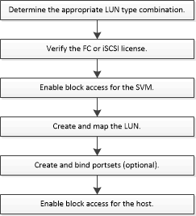

= LUN 설정 워크플로우
:icons: font
:imagesdir: ../media/

[role="lead"]
LUN을 설정하려면 요구사항에 가장 적합한 LUN 유형을 결정해야 합니다. 그런 다음 일련의 작업을 수행하여 프로토콜 라이센스를 확인하고, 블록 액세스를 사용하도록 설정하고, LUN을 생성 및 매핑하고, 호스트에서 블록 액세스를 설정할 수 있습니다. 선택적으로 포트 세트를 LUN 설정 워크플로우의 일부로 생성 및 바인딩할 수도 있습니다.

== ONTAP에서 이 작업을 수행하는 다른 방법

|===

| 을 사용하여 이 작업을 완료하려면... | 자세한 내용은... 

 a| 
재설계된 System Manager(9.7 이상에서 사용 가능)
 a| 
* https://docs.netapp.com/us-en/ontap/task_san_provision_vmware.html["VMware 데이터 저장소에 SAN 스토리지 용량 할당"]
* https://docs.netapp.com/us-en/ontap/task_san_provision_linux.html["Linux 서버용 SAN 스토리지 용량 할당"]
* https://docs.netapp.com/us-en/ontap/task_san_provision_windows.html["Windows 서버용 SAN 스토리지 용량 할당"]

 a| 
System Manager Classic(9.7 이하에서 사용 가능)
 a| 
* https://docs.netapp.com/us-en/ontap-sm-classic/fc-config-esxi/concept_fc_configuration_workflow.html["VSC를 사용한 ESXi용 FC 구성"]
* https://docs.netapp.com/us-en/ontap-sm-classic/fc-config-rhel/concept_fc_configuration_workflow.html["Red Hat Enterprise Linux용 FC 구성"]
* https://docs.netapp.com/us-en/ontap-sm-classic/fc-config-windows/concept_fc_configuration_workflow.html["Windows용 FC 구성"]
* https://docs.netapp.com/us-en/ontap-sm-classic/iscsi-config-esxi/concept_iscsi_configuration_provisioning_workflow.html["VSC를 사용한 ESXi용 iSCSI 구성"]
* https://docs.netapp.com/us-en/ontap-sm-classic/iscsi-config-rhel/index.html["Red Hat Enterprise Linux용 iSCSI 구성"]
* https://docs.netapp.com/us-en/ontap-sm-classic/iscsi-config-windows/concept_iscsi_configuration_workflow.html["Windows용 iSCSI 구성"]

|===