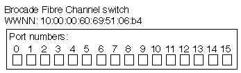

= FC를 통한 SAN 프로비저닝
:allow-uri-read: 
:icons: font
:imagesdir: ../media/

[role="lead"]
ONTAP에서 FC SAN을 구축하는 방법을 이해하는 데 필요한 중요한 개념을 알아야 합니다.

== FC 타겟 노드가 네트워크에 연결되는 방법

스토리지 시스템과 호스트에는 케이블이 있는 FC 스위치에 연결할 수 있는 어댑터가 있습니다.

노드가 FC SAN에 연결되면 각 SVM은 스위치 패브릭 이름 서비스에 LIF의 WWPN(World Wide Port Name)을 등록합니다. SVM의 WWNN과 각 LIF의 WWPN은 ONTAP에서 자동으로 할당됩니다.

[NOTE]
====
FC를 사용하는 호스트의 노드에 대한 직접 연결은 지원되지 않습니다. NPIV가 필요하며 이 경우 스위치를 사용해야 합니다. iSCSI 세션을 사용하면 네트워크 라우팅 또는 직접 연결 중 하나의 연결에서 통신할 수 있습니다. 그러나 이러한 두 가지 방법은 모두 ONTAP에서 지원됩니다.

====

== FC 노드의 식별 방법

FC로 구성된 각 SVM은 WWNN(Worldwide Node Name)으로 식별됩니다.

== WWPN 사용 방법

WWPN은 FC를 지원하도록 구성된 SVM에서 각 LIF를 식별합니다. 이러한 LIF는 클러스터의 각 노드에 있는 물리적 FC 포트를 활용하며, 노드의 FC 타겟 카드, UTA 또는 UTA2 포트를 통해 FC 또는 FCoE로 구성할 수 있습니다.

* 이니시에이터 그룹 생성
+
호스트 HBA의 WWPN은 이니시에이터 그룹(igroup)을 생성하는 데 사용됩니다. igroup은 특정 LUN에 대한 호스트 액세스를 제어하는 데 사용됩니다. FC 네트워크에서 이니시에이터의 WWPN 컬렉션을 지정하여 igroup을 생성할 수 있습니다. 스토리지 시스템의 LUN을 igroup에 매핑할 때 해당 그룹의 모든 이니시에이터가 해당 LUN에 액세스할 수 있도록 허용할 수 있습니다. 호스트의 WWPN이 LUN에 매핑된 igroup에 없는 경우 해당 호스트는 LUN에 액세스할 수 없습니다. 즉, LUN이 해당 호스트의 디스크로 표시되지 않습니다.

+
또한 포트 세트를 생성하여 특정 타겟 포트에만 LUN을 표시할 수 있습니다. 포트 세트는 FC 타겟 포트 그룹으로 구성됩니다. igroup을 포트 세트에 바인딩할 수 있습니다. igroup 내의 모든 호스트는 포트 세트의 타겟 포트에 연결하여 LUN에 액세스할 수 있습니다.

* FC LIF의 고유 식별
+
WWPN은 각 FC 논리 인터페이스를 고유하게 식별합니다. 호스트 운영 체제는 WWNN과 WWPN을 함께 사용하여 SVM 및 FC LIF를 식별합니다. 일부 운영 체제에서는 LUN이 호스트에서 동일한 타겟 ID에 표시되도록 영구 바인딩이 필요합니다.

== 전세계적인 이름 지정 작동 방식

전 세계 이름은 ONTAP에서 순차적으로 생성됩니다. 그러나 ONTAP에서 할당한 방식 때문에 비순차적 순서로 할당된 것처럼 보일 수 있습니다.

각 어댑터에는 사전 구성된 WWPN 및 WWNN이 있지만 ONTAP는 이러한 사전 구성된 값을 사용하지 않습니다. 대신, ONTAP는 온보드 이더넷 포트의 MAC 주소를 기반으로 자체 WWPN 또는 WWNs를 할당합니다.

다음과 같은 이유로 전 세계 이름이 지정되면 비순차적인 것으로 보일 수 있습니다.

* 전 세계 이름은 클러스터의 모든 노드 및 SVM(스토리지 가상 머신)에 할당됩니다.
* 전 세계적으로 확보된 이름은 재활용되고 사용 가능한 이름 풀에 다시 추가됩니다.

== FC 스위치의 식별 방법

파이버 채널 스위치에는 장치 자체를 위한 WWNN(Worldwide Node Name)과 각 포트에 대한 WWPN(Worldwide Port Name)이 하나씩 있습니다.

예를 들어, 다음 다이어그램에서는 16포트 Brocade 스위치의 각 포트에 WWPN을 할당하는 방법을 보여 줍니다. 특정 스위치에 대한 포트 번호 지정 방법에 대한 자세한 내용은 해당 스위치에 대해 공급업체에서 제공한 설명서를 참조하십시오.

포트 * 0 *, WWPN 20:** 00**:00:60:69:51:06:B4

포트 * 1 *, WWPN 20:** 01**:00:60:69:51:06:B4

포트 * 14 *, WWPN 20:** 0E**:00:60:69:51:06:B4

포트 * 15 *, WWPN 20:** 0f**:00:60:69:51:06:B4
