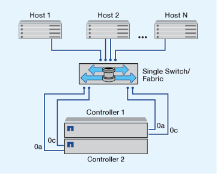
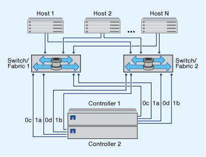

= FC 및 FC-NVMe SAN 호스트를 HA 쌍으로 구성하는 방법
:allow-uri-read: 
:icons: font
:imagesdir: ../media/

[role="lead"]
하나 이상의 패브릭을 통해 FC 및 FC-NVMe SAN 호스트를 HA 쌍에 연결하도록 구성할 수 있습니다. 스위치를 사용하지 않고 FC 또는 FC-NVMe SAN 호스트를 HA 쌍에 직접 연결할 수 없습니다.

캐스케이드, 부분 메시, 풀 메시, 코어 에지 및 디렉터 패브릭은 모두 FC 스위치를 패브릭에 연결하는 업계 표준 방법이며 모두 지원됩니다.  임베디드 블레이드 스위치의 경우를 제외하고 이기종 FC 스위치 패브릭을 사용할 수 없습니다.  특정 예외는 에 나열되어 있습니다 link:https://imt.netapp.com/matrix/["상호 운용성 매트릭스 툴"].

단일 패브릭 HA 쌍 또는 다중 패브릭 HA 쌍을 통해 FC 및 FC-NVMe SAN 호스트를 구성할 수 있습니다. 그림의 FC 대상 포트 번호(0a, 0c, 0d, 1a, 1b)가 예제입니다. 실제 포트 번호는 스토리지 노드의 모델 및 확장 어댑터를 사용하고 있는지에 따라 다릅니다.

== 단일 패브릭 HA 쌍

단일 패브릭 HA 쌍 구성에서는 HA 쌍의 두 컨트롤러를 하나 이상의 호스트에 연결하는 하나의 패브릭이 있습니다. 호스트와 컨트롤러는 단일 스위치를 통해 연결되므로 단일 패브릭 HA 쌍이 완전히 이중화되지 않습니다.

FC 구성을 지원하는 모든 플랫폼은 단일 패브릭 HA 쌍 구성을 지원합니다.

== 멀티패브릭 HA 쌍

다중 패브릭 HA 쌍에는 HA 쌍을 하나 이상의 호스트에 연결하는 스위치가 2개 이상 있습니다. 다음 멀티패브릭 HA 쌍 그림에서는 간소화를 위해 두 개의 패브릭만 표시하지만 다양한 패브릭 구성에서 두 개 이상의 패브릭을 사용할 수 있습니다.

