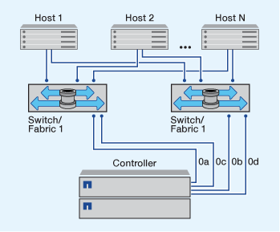

= 단일 노드로 FC 및 FC-NVMe SAN 호스트를 구성하는 방법
:allow-uri-read: 
:icons: font
:imagesdir: ../media/

[role="lead"]
하나 이상의 패브릭을 통해 단일 노드로 FC 및 FC-NVMe SAN 호스트를 구성할 수 있습니다. N-포트 ID 가상화(NPIV)가 필요하며 Fabric의 모든 FC 스위치에서 활성화해야 합니다. FC 스위치를 사용하지 않고 FC 또는 FC-NMVE SAN 호스트를 단일 노드에 직접 연결할 수는 없습니다.

단일 패브릭 또는 멀티패브릭을 통해 단일 노드로 FC 또는 FC-NVMe SAN 호스트를 구성할 수 있습니다. 그림의 FC 타겟 포트(0a, 0c, 0b, 0d)가 예제입니다. 실제 포트 번호는 스토리지 노드의 모델 및 확장 어댑터를 사용하고 있는지에 따라 다릅니다.

== 단일 패브릭 단일 노드 구성

단일 패브릭 단일 노드 구성에서는 단일 노드를 하나 이상의 호스트에 연결하는 하나의 스위치가 있습니다. 단일 스위치가 있으므로 이 구성은 완전히 중복되지 않습니다. FC 및 FC-NVMe를 지원하는 모든 하드웨어 플랫폼은 단일 패브릭 단일 노드 구성을 지원합니다. 하지만 FAS2240 플랫폼에서는 단일 패브릭 단일 노드 구성을 지원하는 X1150A-R6 확장 어댑터가 필요합니다.

다음 그림에서는 FAS2240 단일 패브릭 단일 노드 구성을 보여 줍니다. 또한 스토리지 컨트롤러를 나란히 하여 표시함으로써 FAS2240-2에 설치된 방식을 보여줍니다. FAS2240-4의 경우 컨트롤러가 다른 컨트롤러 위에 마운트됩니다. 두 모델의 SAN 구성에는 차이가 없습니다.

== 멀티패브릭 단일 노드 구성

다중 패브릭 단일 노드 구성에는 단일 노드를 하나 이상의 호스트에 연결하는 스위치가 2개 이상 있습니다. 다음 그림은 간소화를 위해 두 개의 패브릭만 있는 다중 패브릭 단일 노드 구성을 보여 주며 여러 개의 패브릭 구성에서 두 개 이상의 패브릭을 사용할 수 있습니다. 이 그림에서 스토리지 컨트롤러는 상단 섀시에 마운트되며, 하단 섀시는 이 예제에서와 같이 비어 있거나 IOMX 모듈이 있을 수 있습니다.

.관련 정보
http://www.netapp.com/us/media/tr-4684.pdf["NetApp 기술 보고서 4684: NVMe/FC를 사용하여 최신 SAN 구현 및 구성"^]
