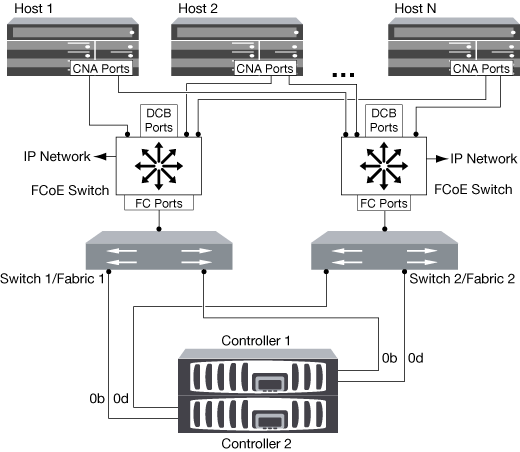
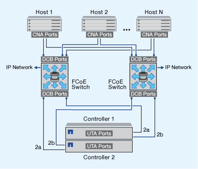
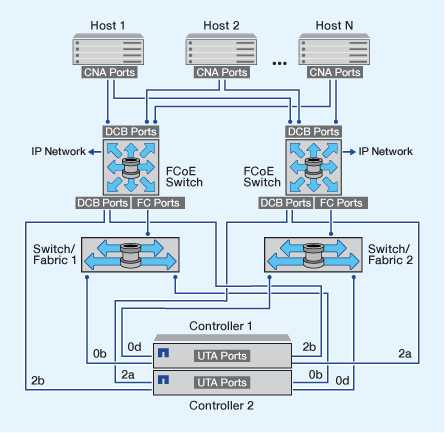

= FCoE 구성 방법 개요
:allow-uri-read: 
:icons: font
:imagesdir: ../media/

[role="lead"]
FCoE는 다양한 방법으로 FCoE 스위치를 사용하여 구성할 수 있습니다. 직접 연결 구성은 FCoE에서 지원되지 않습니다.

모든 FCoE 구성은 이중 패브릭이며 완전히 이중화되며 호스트측 다중 경로 소프트웨어가 필요합니다. 모든 FCoE 구성에서는 이니시에이터와 타겟 사이의 경로에 최대 홉 수 제한까지 여러 FCoE 및 FC 스위치를 포함할 수 있습니다. 스위치를 서로 연결하려면 스위치가 이더넷 ISL을 지원하는 펌웨어 버전을 실행해야 합니다. 모든 FCoE 구성의 각 호스트는 다른 운영 체제로 구성할 수 있습니다.

FCoE 구성에는 FCoE 기능을 명시적으로 지원하는 이더넷 스위치가 필요합니다. FCoE 구성은 FC 스위치와 동일한 상호 운용성 및 품질 보증 프로세스를 통해 검증되었습니다. 지원되는 구성은 상호 운용성 매트릭스 에 나와 있습니다. 이러한 지원되는 구성에 포함된 매개 변수 중 일부는 스위치 모델, 단일 Fabric에 구축할 수 있는 스위치 수 및 지원되는 스위치 펌웨어 버전입니다.

그림에 나와 있는 FC 타겟 확장 어댑터 포트 번호의 예가 나와 있습니다. 실제 포트 번호는 FCoE 대상 확장 어댑터가 설치된 확장 슬롯에 따라 다를 수 있습니다.

== FCoE 이니시에이터에서 FC 타겟으로

CNA(FCoE 이니시에이터)를 사용하면 FCoE 스위치를 FC 타겟 포트에 연결하여 HA 쌍의 두 컨트롤러에 호스트를 연결할 수 있습니다. FCoE 스위치에도 FC 포트가 있어야 합니다. 호스트 FCoE 이니시에이터는 항상 FCoE 스위치에 연결됩니다. FCoE 스위치는 FC 타겟에 직접 연결하거나 FC 스위치를 통해 FC 타겟에 연결할 수 있습니다.

다음 그림에서는 FCoE 스위치에 연결된 호스트 CNA와 HA 쌍에 연결하기 전에 FC 스위치에 연결하는 방법을 보여 줍니다.

== FCoE 이니시에이터에서 FCoE 타겟으로

CNA(호스트 FCoE 이니시에이터)를 사용하면 HA 쌍의 두 컨트롤러에 호스트를 FCoE 스위치를 통해 FCoE 타겟 포트(UTA 또는 UTA2)에 연결할 수 있습니다.

== FCoE 이니시에이터에서 FCoE 및 FC 타겟으로

CNA(호스트 FCoE 이니시에이터)를 사용하면 HA 쌍의 두 컨트롤러에 호스트를 FCoE 스위치를 통해 FCoE 및 FC 타겟 포트(UTA 또는 UTA2)에 연결할 수 있습니다.

== IP 스토리지 프로토콜과 혼합된 FCoE

CNA(호스트 FCoE 이니시에이터)를 사용하면 HA 쌍의 두 컨트롤러에 호스트를 FCoE 스위치를 통해 FCoE 타겟 포트(UTA 또는 UTA2)에 연결할 수 있습니다. FCoE 포트는 단일 스위치에 대한 기존 링크 집계를 사용할 수 없습니다. Cisco 스위치는 FCoE를 지원하는 특수한 유형의 Link Aggregation(가상 포트 채널)을 지원합니다. 가상 포트 채널은 두 스위치에 대한 개별 링크를 집계합니다. 다른 이더넷 트래픽에 가상 포트 채널을 사용할 수도 있습니다. NFS, SMB, iSCSI 및 기타 이더넷 트래픽을 포함하여 FCoE 이외의 트래픽에 사용되는 포트는 FCoE 스위치에서 일반 이더넷 포트를 사용할 수 있습니다.

