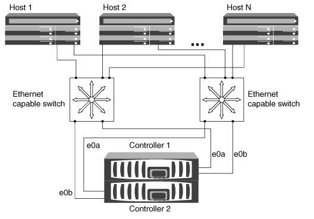

= HA 쌍으로 iSCSI SAN 호스트를 구성하는 방법
:icons: font
:imagesdir: ../media/

[role="lead"]
하나 이상의 IP 스위치를 사용하여 iSCSI SAN 호스트를 이중 노드 또는 다중 노드 구성에 연결하도록 구성할 수 있습니다. 완전히 중복되지 않는 단일 스위치 구성인지 완전히 이중화된 다중 스위치 구성인지 결정해야 합니다.

직접 연결, 단일 네트워크 또는 다중 네트워크 환경에서 단일 컨트롤러와 HA 쌍으로 iSCSI SAN 호스트를 구성할 수 있습니다. HA 쌍은 각 스위치에 대해 여러 iSCSI 연결을 가질 수 있지만, ALUA를 지원하는 다중 경로 소프트웨어는 각 호스트에 필요합니다. 호스트가 여러 개인 경우 NetAppInteroperability Matrix Tool을 확인하여 다른 운영 체제로 각 호스트를 구성할 수 있습니다.

https://mysupport.netapp.com/matrix["NetApp 상호 운용성 매트릭스 툴"]

== 직접 연결

직접 연결 구성에서는 하나 이상의 호스트가 컨트롤러에 직접 연결됩니다.

image::../media/dual-host-dual-controller.gif[이중 호스트 이중 컨트롤러]

== 단일 네트워크 HA 쌍

단일 네트워크 HA Pair 구성에서 1개의 스위치는 HA 쌍을 하나 이상의 호스트에 연결합니다. 단일 스위치가 있으므로 이 구성은 완전히 중복되지 않습니다.

image::../media/scrn-en-drw-iscsi-single.gif[SCRN en drw iSCSI 단일]

== 다중 네트워크 HA 쌍

다중 네트워크 HA 쌍 구성에서는 2개 이상의 스위치가 하나 이상의 호스트에 HA 쌍을 연결합니다. 스위치가 여러 개 있으므로 이 구성은 완전히 중복됩니다.

