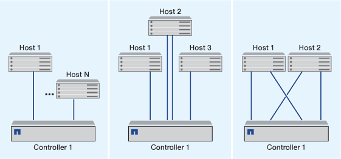

= 단일 노드로 iSCSI SAN 호스트를 구성하는 방법
:icons: font
:imagesdir: ../media/

[role="lead"]
단일 노드에 직접 접속하거나 하나 이상의 IP 스위치를 사용하여 iSCSI SAN 호스트를 구성할 수 있습니다. 완전히 중복되지 않는 단일 스위치 구성인지 완전히 이중화된 다중 스위치 구성인지 결정해야 합니다.

직접 연결, 단일 스위치 또는 다중 스위치 환경에서 iSCSI SAN 호스트를 구성할 수 있습니다. 노드에 접속된 호스트가 여러 개인 경우 각 호스트를 다른 운영 체제로 구성할 수 있습니다. 단일 및 다중 네트워크 구성의 경우 노드에 스위치에 대한 여러 iSCSI 연결이 있을 수 있지만 ALUA를 지원하는 다중 경로 소프트웨어가 필요합니다.

[NOTE]
====
호스트에서 컨트롤러로의 경로가 여러 개인 경우 호스트에서 ALUA를 활성화해야 합니다.

====

== 직접 연결 단일 노드 구성

직접 연결 구성에서는 하나 이상의 호스트가 노드에 직접 연결됩니다.

== 단일 네트워크 단일 노드 구성

단일 네트워크 단일 노드 구성에서는 하나의 스위치를 하나 이상의 호스트에 연결합니다. 단일 스위치가 있으므로 이 구성은 완전히 중복되지 않습니다.

image::../media/r-oc-set-iscsi-singlenetwork-singlenode.gif[r OC는 iSCSI singlenetwork singlenode를 설정합니다]

== 다중 네트워크 단일 노드 구성

다중 네트워크 단일 노드 구성에서는 두 개 이상의 스위치가 단일 노드를 하나 이상의 호스트에 연결합니다. 스위치가 여러 개 있으므로 이 구성은 완전히 중복됩니다.

image::../media/scrn-en-drw-iscsi-multinw-singlen.gif[SCRN en drw iSCSI 다국적 기업]
