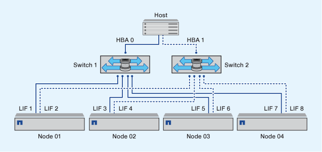

= 이중 패브릭 HA 쌍 조닝
:allow-uri-read: 
:icons: font
:imagesdir: ../media/

[role="lead"]
이중 패브릭 구성에서는 각 호스트 이니시에이터를 각 클러스터 노드에 연결할 수 있습니다. 각 호스트 이니시에이터는 다른 스위치를 사용하여 클러스터 노드에 액세스합니다. 다중 경로를 관리하려면 호스트에 다중 경로 소프트웨어가 필요합니다.

이중 패브릭 구성은 단일 구성 요소에 장애가 발생해도 데이터 액세스가 유지되므로 고가용성으로 간주됩니다.

다음 그림에서는 두 개의 이니시에이터가 있고 다중 경로 소프트웨어가 실행 중인 호스트를 보여 줍니다. 두 개의 구역이 있습니다. 모든 노드가 보고 노드로 간주되도록 SLM이 구성됩니다.

[NOTE]
====
이 그림에 사용된 명명 규칙은 ONTAP 솔루션에 사용할 수 있는 명명 규칙 중 하나에 불과합니다.

====
* 존 1: HBA 0, LIF_1, LIF_3, LIF_5 및 LIF_7
* 구역 2: HBA 1, LIF_2, LIF_4, LIF_6 및 LIF_8

각 호스트 이니시에이터는 다른 스위치를 통해 조닝됩니다. 구역 1은 스위치 1을 통해 액세스합니다. 구역 2는 스위치 2를 통해 액세스합니다.

각 이니시에이터는 모든 노드의 LIF에 액세스할 수 있습니다. 따라서 노드에 장애가 발생하더라도 호스트가 LUN에 액세스할 수 있습니다. SVM은 SLM(Selective LUN Map) 및 보고 노드 구성에 따라 클러스터 솔루션의 모든 노드에 있는 모든 iSCSI 및 FC LIF에 액세스할 수 있습니다. SLM, 포트 세트 또는 FC 스위치 조닝을 사용하여 SVM에서 호스트로의 경로 수와 SVM에서 LUN으로의 경로 수를 줄일 수 있습니다.

구성에 더 많은 노드가 포함된 경우 추가 노드의 LIF가 이 영역에 포함됩니다.

[NOTE]
====
호스트 운영 체제 및 다중 경로 소프트웨어는 노드의 LUN에 액세스하는 데 사용되는 경로 수를 지원해야 합니다.

====
.관련 정보
https://hwu.netapp.com["NetApp Hardware Universe를 참조하십시오"^]
