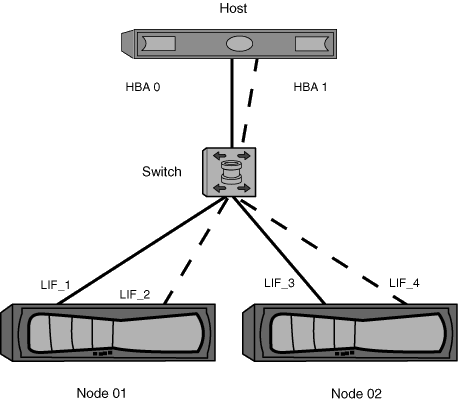

= 단일 패브릭 조닝
:allow-uri-read: 
:icons: font
:imagesdir: ../media/

[role="lead"]
단일 패브릭 구성에서는 각 호스트 이니시에이터를 각 스토리지 노드에 연결할 수 있습니다. 다중 경로를 관리하려면 호스트에 다중 경로 소프트웨어가 필요합니다. 솔루션에서 복원력을 제공하려면 각 호스트에 두 개의 이니시에이터를 구성하여 다중 경로를 구현해야 합니다.

각 이니시에이터는 이니시에이터가 액세스할 수 있는 각 노드의 LIF가 하나 이상 있어야 합니다. 조닝을 사용하면 호스트 이니시에이터에서 클러스터의 HA 노드 쌍에 대한 경로를 하나 이상 허용하여 LUN 접속 경로를 제공할 수 있어야 합니다. 즉, 호스트의 각 이니시에이터에는 자신의 존 구성 내 노드당 하나의 대상 LIF만 있을 수 있음을 의미합니다. 클러스터에서 동일한 노드 또는 여러 노드에 대한 다중 경로가 필요한 경우 각 노드의 존 구성에 노드당 여러 개의 LIF가 존재하게 됩니다. 따라서 노드에 장애가 발생하거나 LUN이 포함된 볼륨이 다른 노드로 이동되는 경우에도 호스트는 계속 LUN에 액세스할 수 있습니다. 또한 보고 노드를 적절하게 설정해야 합니다.

단일 패브릭 구성은 지원되지만 고가용성으로 간주되지는 않습니다. 단일 구성 요소가 실패할 경우 데이터에 대한 액세스가 손실될 수 있습니다.

다음 그림에서는 두 개의 이니시에이터가 있고 다중 경로 소프트웨어가 실행 중인 호스트를 보여 줍니다. 두 개의 영역이 있습니다.

[NOTE]
====
이 그림에 사용된 명명 규칙은 ONTAP 솔루션에 사용할 수 있는 명명 규칙 중 하나에 불과합니다.

====
* 구역 1: HBA 0, LIF_1 및 LIF_3
* 구역 2: HBA 1, LIF_2 및 LIF_4

구성에 더 많은 노드가 포함된 경우 추가 노드의 LIF가 이 영역에 포함됩니다.

이 예제에서는 각 영역에 4개의 LIF를 모두 가질 수도 있습니다. 이 경우 영역은 다음과 같습니다.

* 존 1: HBA 0, LIF_1, LIF_2, LIF_3 및 LIF_4
* 존 2: HBA 1, LIF_1, LIF_2, LIF_3 및 LIF_4

[NOTE]
====
호스트 운영 체제 및 다중 경로 소프트웨어는 노드의 LUN에 액세스하는 데 사용되는 지원되는 경로 수를 지원해야 합니다. 노드의 LUN에 액세스하는 데 사용되는 경로 수를 확인하려면 SAN 구성 제한 섹션을 참조하십시오.

====
.관련 정보
https://["NetApp Hardware Universe를 참조하십시오"^]
