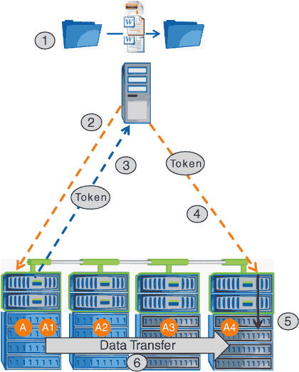

= ODX의 작동 방식
:allow-uri-read: 
:icons: font
:imagesdir: ../media/

[role="lead"]
ODX 복사 오프로드는 토큰 기반 메커니즘을 사용하여 ODX 지원 CIFS 서버 내부 또는 간에 데이터를 읽고 씁니다. CIFS 서버는 데이터를 호스트를 통해 라우팅하는 대신 데이터를 나타내는 작은 토큰을 클라이언트에 보냅니다. ODX 클라이언트는 해당 토큰을 대상 서버에 제공하고, 이 토큰을 통해 표시되는 데이터를 소스에서 타겟으로 전송할 수 있습니다.

ODX 클라이언트는 CIFS 서버가 ODX를 지원하는 서버임을 인식하면 소스 파일을 열고 CIFS 서버에서 토큰을 요청합니다. 대상 파일을 연 후 클라이언트는 토큰을 사용하여 서버에서 데이터를 소스에서 대상으로 직접 복사하도록 지시합니다.

[NOTE]
====
복사 작업의 범위에 따라 소스 및 대상이 동일한 SVM(스토리지 가상 머신) 또는 다른 SVM에 있을 수 있습니다.

====
토큰은 데이터의 시점 표현의 역할을 합니다. 예를 들어, 스토리지 위치 간에 데이터를 복사할 때 데이터 세그먼트를 나타내는 토큰이 요청 클라이언트로 반환되고, 이 클라이언트는 대상에 복사되므로 클라이언트를 통해 기본 데이터를 복사할 필요가 없습니다.

ONTAP는 8MB의 데이터를 나타내는 토큰을 지원합니다. 8MB를 초과하는 ODX 복제본은 8MB의 데이터를 나타내는 각 토큰과 함께 여러 토큰을 사용하여 수행됩니다.

다음 그림에서는 ODX 복사 작업과 관련된 단계를 설명합니다.

. 사용자가 Windows 탐색기, 명령줄 인터페이스 또는 가상 시스템 마이그레이션의 일부로 파일을 복사 또는 이동하거나 응용 프로그램이 파일 복사 또는 이동을 시작합니다.
. ODX 지원 클라이언트는 이 전송 요청을 ODX 요청으로 자동 변환합니다.
+
CIFS 서버로 전송되는 ODX 요청에 토큰에 대한 요청이 있습니다.

. CIFS 서버에서 ODX가 설정되어 있고 연결이 SMB 3.0을 통해 설정되어 있으면 CIFS 서버가 토큰을 생성합니다. 이는 소스에서 데이터를 논리적으로 표현한 것입니다.
. 클라이언트는 데이터를 나타내는 토큰을 받아 쓰기 요청과 함께 대상 CIFS 서버로 전송합니다.
+
이 데이터는 네트워크를 통해 소스에서 클라이언트로 복사한 다음 클라이언트에서 대상으로 복사하는 유일한 데이터입니다.

. 토큰이 스토리지 서브시스템에 제공됩니다.
. SVM은 내부적으로 복사 또는 이동을 수행합니다.
+
복사 또는 이동된 파일이 8MB보다 큰 경우 복제를 수행하려면 여러 토큰이 필요합니다. 필요에 따라 복사를 완료하기 위해 2-6단계를 수행합니다.

[NOTE]
====
ODX 복사 작업을 오프로드하는 데 장애가 발생하면 복사 또는 이동 작업이 복사 또는 이동 작업에 대한 기존 읽기 및 쓰기로 다시 이동됩니다. 마찬가지로, 대상 CIFS 서버가 ODX 또는 ODX를 지원하지 않을 경우 복사 또는 이동 작업이 복사 또는 이동 작업에 대한 기존 읽기 및 쓰기로 다시 돌아갑니다.

====