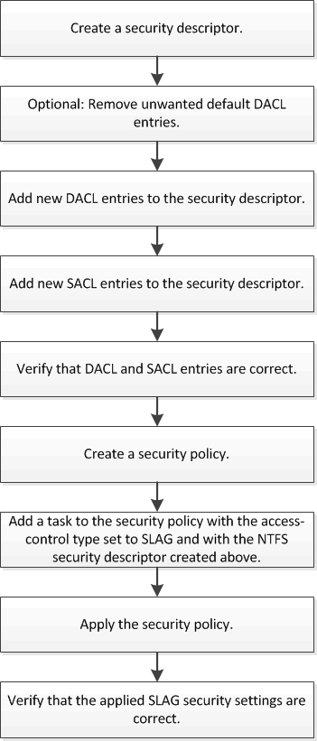

= Storage-Level Access Guard를 구성하는 워크플로우
:icons: font
:imagesdir: ../media/

[role="lead"]
스토리지 레벨 액세스 가드(slag)를 구성하는 워크플로에서는 NTFS 파일 권한 및 감사 정책을 구성하는 데 사용하는 것과 동일한 ONTAP CLI 명령을 사용합니다. 지정된 대상에서 파일 및 디렉토리 액세스를 구성하는 대신 지정된 SVM(스토리지 가상 머신) 볼륨의 슬래그를 구성합니다.

xref:configure-storage-level-access-guard-task.adoc[Storage-Level Access Guard 구성]
