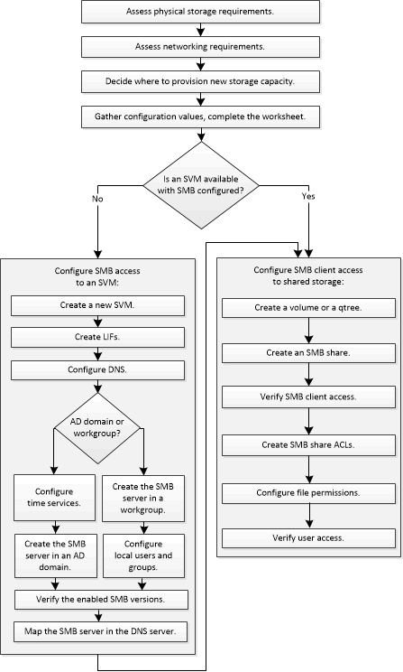

= SMB 구성 워크플로우
:allow-uri-read: 
:icons: font
:imagesdir: ../media/

[role="lead"]
SMB를 구성하려면 물리적 스토리지 및 네트워킹 요구사항을 평가한 다음 목표에 맞는 워크플로우를 선택하고, 새 SVM 또는 기존 SVM에 SMB 액세스를 구성하거나, SMB 액세스에 대해 이미 완벽하게 구성된 기존 SVM에 볼륨 또는 qtree를 추가해야 합니다.

