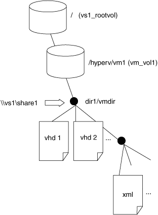

= 원격 VSS에서 사용하는 디렉토리 구조의 예
:icons: font
:imagesdir: ../media/

[role="lead"]
원격 VSS는 섀도우 복제본을 생성할 때 Hyper-V 가상 머신 파일을 저장하는 디렉토리 구조를 통과합니다. 가상 머신 파일의 백업을 성공적으로 생성할 수 있도록 적절한 디렉토리 구조가 무엇인지 이해하는 것이 중요합니다.

섀도우 복제본을 성공적으로 생성하기 위해 지원되는 디렉토리 구조는 다음 요구 사항을 따릅니다.

* 가상 머신 파일을 저장하는 데 사용되는 디렉토리 구조 내에는 디렉토리와 일반 파일만 있습니다.
+
디렉터리 구조에는 연결 지점, 링크 또는 비정규 파일이 포함되어 있지 않습니다.

* 가상 머신의 모든 파일은 단일 공유 내에 있습니다.
* 가상 머신 파일을 저장하는 데 사용되는 디렉토리 구조가 섀도 복사본 디렉토리의 구성된 깊이를 초과하지 않습니다.
* 공유의 루트 디렉토리에는 가상 머신 파일 또는 디렉토리만 포함됩니다.

다음 그림에서는 vm_vol1이라는 이름의 볼륨이 SVM(Storage Virtual Machine) VS1 의 '/hyperv/vm1'에 있는 접합 지점으로 생성됩니다. 가상 머신 파일을 포함하는 하위 디렉토리는 교차점 아래에 생성됩니다. Hyper-V 서버의 가상 머신 파일은 "/hyperv/vm1/dir1/vmdir" 경로가 있는 share1을 통해 액세스합니다. 섀도 복사본 서비스는 share1 아래의 디렉토리 구조 내에 포함된 모든 가상 머신 파일의 섀도 복사본을 만듭니다(섀도우 복제본 디렉토리의 구성된 깊이까지).

