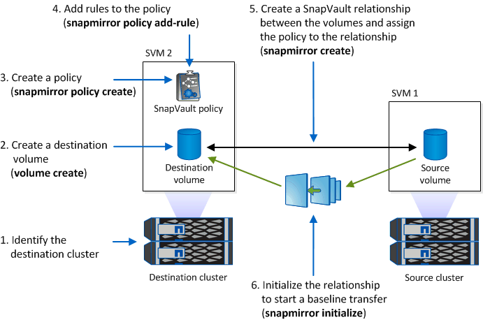

= WORM에 스냅샷 복사본 커밋
:allow-uri-read: 
:icons: font
:imagesdir: ../media/

[role="lead"]
SnapLock for SnapVault를 사용하여 2차 스토리지에서 WORM 상태로 스냅샷 복사본을 보호할 수 있습니다. SnapVault 대상에서 모든 기본 SnapLock 작업을 수행합니다. 타겟 볼륨이 읽기 전용으로 자동 마운트되므로 Snapshot 복사본을 WORM에 명시적으로 커밋할 필요가 없습니다. 따라서 SnapMirror 정책을 사용하여 타겟 볼륨에 예약된 Snapshot 복사본을 생성하는 것은 지원되지 않습니다.

.시작하기 전에
* 소스 클러스터는 ONTAP 8.2.2 이상을 실행해야 합니다.
* 소스 및 타겟 애그리게이트는 64비트여야 합니다.
* 소스 볼륨은 SnapLock 볼륨일 수 없습니다.
* 피어링된 SVM이 있는 클러스터에서 소스 및 타겟 볼륨을 생성해야 합니다.
+
자세한 내용은 을 참조하십시오 link:https://docs.netapp.com/us-en/ontap-sm-classic/peering/index.html["클러스터 피어링"].

* 볼륨 자동 확장 기능을 사용하지 않는 경우 대상 볼륨의 여유 공간은 소스 볼륨의 사용된 공간보다 최소 5% 이상 커야 합니다.

소스 볼륨에서 NetApp 또는 타사 스토리지를 사용할 수 있습니다. 타사 스토리지의 경우 FlexArray 가상화를 사용해야 합니다.

NOTE: WORM 상태로 커밋된 스냅샷 복사본의 이름은 변경할 수 없습니다.

SnapLock 볼륨의 클론을 생성할 수는 있지만 SnapLock 볼륨의 파일은 복제할 수 없습니다.

NOTE: LUN은 SnapLock 볼륨에서 지원되지 않습니다. 기존 기술을 사용하여 SnapLock 볼륨으로 LUN을 이동할 수는 있지만 이 작업은 지원되지 않으며 SnapLock 볼륨에 LUN을 포함하는 다른 작업은 지원되지 않습니다.

MetroCluster 구성의 경우 다음 사항에 유의해야 합니다.

* 동기식 소스 SVM과 동기식-타겟 SVM 간에는 동기식-소스 SVM 사이만이 아니라 SnapVault 관계를 생성할 수 있습니다.
* 동기화 소스 SVM의 볼륨에서 데이터 지원 SVM으로 SnapVault 관계를 생성할 수 있습니다.
* 데이터 지원 SVM의 볼륨에서 동기화 소스 SVM의 DP 볼륨으로 SnapVault 관계를 생성할 수 있습니다.

다음 그림에서는 SnapVault 관계를 초기화하는 절차를 보여 줍니다.

.단계
. 대상 클러스터를 식별합니다.
. 대상 클러스터에서 SnapLock 라이센스를 설치하고 ComplianceClock을 초기화하며 9.10.1 이전의 ONTAP 릴리스를 사용하는 경우 에 설명된 대로 SnapLock 애그리게이트를 생성합니다 xref:workflow-concept.html[SnapLock 워크플로].
. 대상 클러스터에서 소스 볼륨보다 크거나 같은 dP 유형의 SnapLock 대상 볼륨을 생성합니다.
+
'* 볼륨 생성 - vserver_SVM_name_-volume_volume_name_-aggregate_aggregate_name_-snaplock-type compliance|enterprise-type dp-size_size_ *'

+
[NOTE]
====
ONTAP 9.10.1부터 SnapLock 및 비 SnapLock 볼륨은 동일한 애그리게이트에 존재할 수 있으므로, ONTAP 9.10.1을 사용하는 경우 더 이상 별도의 SnapLock 애그리게이트를 생성할 필요가 없습니다. volume-snaplock-type 옵션을 사용하여 Compliance 또는 Enterprise SnapLock 볼륨 유형을 지정합니다. ONTAP 9.10.1 이전의 ONTAP 릴리즈에서는 SnapLock 모드, 규정 준수 또는 엔터프라이즈가 aggregate에서 상속됩니다. 버전에 상관없이 유연한 타겟 볼륨이 지원되지 않습니다. 대상 볼륨의 언어 설정은 소스 볼륨의 언어 설정과 일치해야 합니다.

====
+
다음 명령을 실행하면 node01_aggr 집계 'sVM2'에 dstvolB라는 이름의 2GB SnapLock 'Compliance' 볼륨이 생성됩니다.

+
[listing]
----
cluster2::> volume create -vserver SVM2 -volume dstvolB -aggregate node01_aggr -snaplock-type compliance -type DP -size 2GB
----
. 에 설명된 대로 대상 클러스터에서 기본 보존 기간을 설정합니다 xref:set-default-retention-period-task.adoc[기본 보존 기간을 설정합니다].
+
[NOTE]
====
볼트 대상인 SnapLock 볼륨에 기본 보존 기간이 할당되어 있습니다. 이 기간의 값은 처음에 SnapLock 엔터프라이즈 볼륨의 경우 0년, SnapLock 규정 준수 볼륨의 경우 최대 30년으로 설정됩니다. 각 NetApp 스냅샷 복사본은 처음에 이 기본 보존 기간을 사용하여 커밋됩니다. 필요한 경우 보존 기간을 나중에 연장할 수 있습니다. 자세한 내용은 을 참조하십시오 xref:set-retention-period-task.adoc[보존 시간 개요를 설정합니다].

====
. xref:../data-protection/create-replication-relationship-task.adoc[새 복제 관계를 생성합니다] 비 SnapLock 소스와 3단계에서 생성한 새 SnapLock 대상 간
+
이 예에서는 일별 및 주별 이라는 레이블이 지정된 스냅샷 복사본을 시간별 스케줄로 저장할 수 있는 "XDPDefault" 정책을 사용하여 대상 SnapLock 볼륨 DstvolB와 새로운 SnapMirror 관계를 생성합니다.

+
[listing]
----
cluster2::> snapmirror create -source-path SVM1:srcvolA -destination-path SVM2:dstvolB -vserver SVM2 -policy XDPDefault -schedule hourly
----
+
[NOTE]
====
xref:../data-protection/create-custom-replication-policy-concept.adoc[사용자 지정 복제 정책을 생성합니다] 또는 a xref:../data-protection/create-replication-job-schedule-task.adoc[사용자 지정 일정] 사용 가능한 기본값이 적합하지 않은 경우

====
. 대상 SVM에서 5단계에서 생성한 SnapVault 관계를 초기화합니다.
+
'* SnapMirror initialize-destination-path_destination_path_*'

+
다음 명령을 실행하면 'VM1'의 소스 볼륨 'rcvolA'와 'VM2'의 대상 볼륨 'dstvolB'의 관계가 초기화됩니다.

+
[listing]
----
cluster2::> snapmirror initialize -destination-path SVM2:dstvolB
----
. 관계가 초기화되고 유휴 상태가 된 후 대상에서 'napshot show' 명령을 사용하여 복제된 스냅샷 복사본에 적용된 SnapLock 만료 시간을 확인합니다.
+
이 예에서는 SnapMirror 레이블과 SnapLock 만료 날짜가 있는 볼륨 DstvolB의 스냅샷 복사본을 보여 줍니다.

+
[listing]
----
cluster2::> snapshot show -vserver SVM2 -volume dstvolB -fields snapmirror-label, snaplock-expiry-time
----

https://docs.netapp.com/us-en/ontap-sm-classic/peering/index.html["클러스터 및 SVM 피어링"]

https://docs.netapp.com/us-en/ontap-sm-classic/volume-backup-snapvault/index.html["SnapVault를 사용한 볼륨 백업"]
