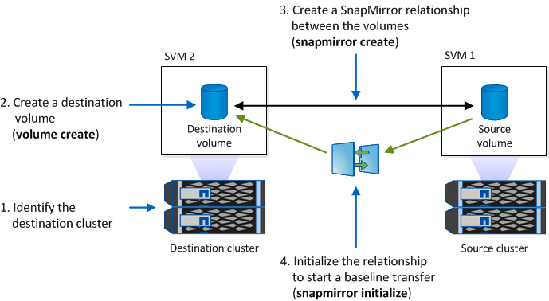

= WORM 파일 미러링
:allow-uri-read: 
:icons: font
:imagesdir: ../media/

[role="lead"]
SnapMirror를 사용하여 재해 복구 및 기타 목적으로 WORM 파일을 다른 지리적 위치에 복제할 수 있습니다. 소스 볼륨과 타겟 볼륨을 모두 SnapLock에 대해 구성해야 하며 두 볼륨 모두 동일한 SnapLock 모드, Compliance 또는 Enterprise를 사용해야 합니다. 볼륨과 파일의 모든 주요 SnapLock 속성이 복제됩니다.

.필수 구성 요소
피어링된 SVM이 있는 클러스터에서 소스 및 타겟 볼륨을 생성해야 합니다. 자세한 내용은 을 참조하십시오 https://docs.netapp.com/us-en/ontap-sm-classic/peering/index.html["클러스터 및 SVM 피어링"].

.이 작업에 대해
* ONTAP 9.5부터 DP(데이터 보호) 유형 관계가 아닌 XDP(확장된 데이터 보호) 유형의 SnapMirror 관계로 WORM 파일을 복제할 수 있습니다. XDP 모드는 ONTAP 버전에 독립적이며 동일한 블록에 저장된 파일을 구분할 수 있으므로 복제된 Compliance 모드 볼륨을 재동기화하는 것이 훨씬 쉬워집니다. 기존 DP 유형 관계를 XDP 유형 관계로 변환하는 방법에 대한 자세한 내용은 을 참조하십시오 link:../data-protection/index.html["데이터 보호"].
* SnapLock에서 데이터 손실을 결정하면 DP 유형의 SnapMirror 관계에 대한 재동기화 작업이 Compliance-Mode 볼륨에 대해 실패합니다. 재동기화 작업이 실패하면 "volume clone create" 명령을 사용하여 대상 볼륨의 클론을 생성할 수 있습니다. 그런 다음 소스 볼륨을 클론과 다시 동기화할 수 있습니다.
* SnapLock 호환 볼륨 간의 XDP 유형의 SnapMirror 관계는 중단 후 대상의 데이터가 소스(중단 후)에서 분기된 경우에도 중단 후 재동기화를 지원합니다.
+
재동기화에서 일반 스냅샷을 넘어 소스 간에 데이터 발산이 감지되면 대상에서 새 스냅샷이 잘려 이러한 발산을 캡처합니다. 새 스냅샷과 공통 스냅샷은 모두 다음과 같이 보존 시간으로 잠깁니다.

+
** 대상의 볼륨 만료 시간입니다
** 볼륨 만료 시간이 지난 시간이거나 설정되지 않은 경우 스냅샷이 30일 동안 잠깁니다
** 대상에 법적 보존 기간이 있는 경우 실제 볼륨 만료 기간이 마스킹되고 ''무제한''으로 표시되지만 실제 볼륨 만료 기간 동안 스냅숏이 잠깁니다.

대상 볼륨의 만료 기간이 소스보다 이후인 경우 대상 만료 기간이 유지되고 재동기화 후 소스 볼륨의 만료 기간에 의해 덮어쓰이지 않습니다.

대상과 소스가 다른 법적 구속이 있는 대상에는 재동기화가 허용되지 않습니다. 재동기화를 시도하기 전에 소스와 대상에서 동일한 법적 증거 자료 보관 또는 모든 법적 고지를 해제해야 합니다.

에서 CLI를 사용하여 일관되지 않은 데이터를 캡처하기 위해 생성된 대상 볼륨의 잠긴 스냅샷 복사본을 소스에 복사할 수 있습니다 `snapmirror update -s snapshot` 명령. 복제된 스냅샷은 소스에서 계속 잠깁니다.

* SVM 데이터 보호 관계는 지원되지 않습니다.
* 로드 공유 데이터 보호 관계는 지원되지 않습니다.

다음 그림에서는 SnapMirror 관계를 초기화하는 절차를 보여 줍니다.

[role="tabbed-block"]
====
.시스템 관리자
--
ONTAP 9.12.1부터 System Manager를 사용하여 WORM 파일의 SnapMirror 복제를 설정할 수 있습니다.

.단계
. Storage > Volumes * 로 이동합니다.
. 표시/숨기기 * 를 클릭하고 * SnapLock 유형 * 을 선택하여 * 볼륨 * 창에 열을 표시합니다.
. SnapLock 볼륨을 찾습니다.
. 을 클릭합니다 image:icon_kabob.gif["Alt = 메뉴 옵션"] 를 클릭하고 * 보호 * 를 선택합니다.
. 대상 클러스터와 대상 스토리지 VM을 선택합니다.
. 추가 옵션 * 을 클릭합니다.
. 기존 정책 표시 * 를 선택하고 * DPDefault(레거시) * 를 선택합니다.
. Destination Configuration details * 섹션에서 * Override transfer schedule * 을 선택하고 * hourly * 를 선택합니다.
. 저장 * 을 클릭합니다.
. 소스 볼륨 이름 왼쪽의 화살표를 클릭하여 볼륨 세부 정보를 확장하고 페이지 오른쪽의 원격 SnapMirror 보호 세부 정보를 검토합니다.
. 원격 클러스터에서 * 보호 관계 * 로 이동합니다.
. 관계를 찾고 대상 볼륨 이름을 클릭하여 관계 세부 정보를 봅니다.
. 대상 볼륨 SnapLock 유형 및 기타 SnapLock 정보를 확인합니다.

--
.CLI를 참조하십시오
--
. 대상 클러스터를 식별합니다.
. 대상 클러스터에서 SnapLock 라이센스를 설치하고 ComplianceClock을 초기화하며 9.10.1 이전의 ONTAP 릴리스를 사용하는 경우 SnapLock 애그리게이트를 생성합니다.
. 대상 클러스터에서 소스 볼륨과 크기가 같거나 더 큰 dP 유형의 SnapLock 대상 볼륨을 생성합니다.
+
'* 볼륨 생성 - vserver_SVM_name_-volume_volume_name_-aggregate_aggregate_name_-snaplock-type compliance|enterprise-type dp-size_size_ *'

+

NOTE: ONTAP 9.10.1부터 SnapLock 및 비 SnapLock 볼륨은 동일한 애그리게이트에 존재할 수 있으므로, ONTAP 9.10.1을 사용하는 경우 더 이상 별도의 SnapLock 애그리게이트를 생성할 필요가 없습니다. volume-snaplock-type 옵션을 사용하여 Compliance 또는 Enterprise SnapLock 볼륨 유형을 지정합니다. ONTAP 9.10.1 이전 버전의 ONTAP 릴리스에서는 SnapLock 모드(준수 또는 엔터프라이즈)가 aggregate에서 상속됩니다. 버전에 상관없이 유연한 타겟 볼륨이 지원되지 않습니다. 대상 볼륨의 언어 설정은 소스 볼륨의 언어 설정과 일치해야 합니다.

+
다음 명령을 실행하면 node01_aggr 집계 'sVM2'에 dstvolB라는 이름의 2GB SnapLock 'Compliance' 볼륨이 생성됩니다.

+
[listing]
----
cluster2::> volume create -vserver SVM2 -volume dstvolB -aggregate node01_aggr -snaplock-type compliance -type DP -size 2GB
----
. 대상 SVM에서 SnapMirror 정책을 생성합니다.
+
'* SnapMirror 정책 create-vserver_SVM_name_-policy_policy_name_*'

+
다음 명령을 실행하면 SVM 전체의 정책 'VM1-mirror'가 생성됩니다.

+
[listing]
----
SVM2::> snapmirror policy create -vserver SVM2 -policy SVM1-mirror
----
. 대상 SVM에서 SnapMirror 일정을 생성합니다.
+
'* 작업 일정 cron create-name_schedule_name_-DayOfWeek_day_of_week_-hour_hour_-minute_minute_*'

+
다음 명령을 실행하면 "weekendcron"이라는 SnapMirror 스케줄이 생성됩니다.

+
[listing]
----
SVM2::> job schedule cron create -name weekendcron -dayofweek "Saturday, Sunday" -hour 3 -minute 0
----
. 대상 SVM에서 SnapMirror 관계 생성:
+
'* SnapMirror create-source-path_source_path_-destination-path_destination_path_-type XDP|policy_policy_name_-schedule_schedule_name_*'

+
다음 명령을 실행하면 'VM1'의 소스 볼륨 'rcvolA'와 'VM2'의 대상 볼륨 'dstvolB'의 SnapMirror 관계가 생성되고 정책 'VM1-mirror'와 스케줄 'weekendcron'이 할당됩니다.

+
[listing]
----
SVM2::> snapmirror create -source-path SVM1:srcvolA -destination-path SVM2:dstvolB -type XDP -policy SVM1-mirror -schedule weekendcron
----
+

NOTE: XDP 유형은 ONTAP 9.5 이상에서 사용할 수 있습니다. ONTAP 9.4 이전 버전에서 DP 유형을 사용해야 합니다.

. 대상 SVM에서 SnapMirror 관계를 초기화합니다.
+
'* SnapMirror initialize-destination-path_destination_path_*'

+
초기화 프로세스는 대상 볼륨에 대해 _baseline 전송_을 수행합니다. SnapMirror는 소스 볼륨의 스냅샷 복사본을 만든 다음 해당 복사본과 이 복사본이 대상 볼륨에 참조하는 모든 데이터 블록을 전송합니다. 소스 볼륨의 다른 스냅샷 복사본도 타겟 볼륨으로 전송합니다.

+
다음 명령을 실행하면 'VM1'의 소스 볼륨 'rcvolA'와 'VM2'의 대상 볼륨 'dstvolB'의 관계가 초기화됩니다.

+
[listing]
----
SVM2::> snapmirror initialize -destination-path SVM2:dstvolB
----

--
====
.관련 정보
https://docs.netapp.com/us-en/ontap-sm-classic/peering/index.html["클러스터 및 SVM 피어링"]

https://docs.netapp.com/us-en/ontap-sm-classic/volume-disaster-prep/index.html["볼륨 재해 복구 준비"]

link:../data-protection/index.html["데이터 보호"]
