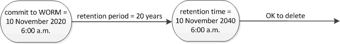

= 보존 시간 개요를 설정합니다
:icons: font
:imagesdir: ../media/

[role="lead"]
파일의 보존 시간을 명시적으로 설정하거나 볼륨에 대한 기본 보존 기간을 사용하여 보존 시간을 파생시킬 수 있습니다. 보존 시간을 명시적으로 설정하지 않으면 SnapLock에서는 기본 보존 기간을 사용하여 보존 시간을 계산합니다.

== 보존 기간 및 보존 시간에 대해 설명합니다

WORM 파일의 _retention period_는 파일이 WORM 상태로 커밋된 후 보존되어야 하는 시간을 지정합니다. WORM 파일의 _retention time_은 파일을 더 이상 보존할 필요가 없는 시간입니다. 예를 들어, 2020년 11월 10일 오전 6시 부터 WORM 상태로 커밋된 파일의 보존 기간은 20년이며, 보존 기간은 2010년 11월 10일 오전 6시입니다

[NOTE]
====
ONTAP 9.10.1부터 최대 10월 26일, 3058까지의 보존 기간 및 최대 100년의 보존 기간을 설정할 수 있습니다. 보존 날짜를 확장하면 이전 정책이 자동으로 변환됩니다. ONTAP 9.9.1 및 이전 릴리즈에서는 기본 보존 기간을 무한으로 설정하지 않으면 지원되는 최대 보존 시간은 1월 19 2071(GMT)입니다.

====

== 중요한 되돌리기 고려 사항

보존 기간이 "January 19, 2071 8:44:07 AM"보다 늦은 파일이 있는 경우 ONTAP는 클러스터가 ONTAP 9.10.1에서 이전 ONTAP 버전으로 복구되지 않도록 합니다.

== 기본 보존 기간 이해

SnapLock 규정 준수 또는 엔터프라이즈 볼륨의 보존 기간은 4가지입니다.

* 최소 보존 기간(min), 기본값 0
* 최대 보존 기간(최대)(기본값: 30년
* ONTAP 9.10.1부터 준수 모드 및 엔터프라이즈 모드 모두에 대해 기본 보존 기간(기본값: "in")입니다. ONTAP 9.10.1 이전의 ONTAP 릴리즈에서는 기본 보존 기간이 모드에 따라 다릅니다.
+
** 준수 모드의 경우 기본값은 'Max'입니다.
** 엔터프라이즈 모드의 경우 기본값은 'in'입니다.

* 지정되지 않은 보존 기간.
+
ONTAP 9.8부터 볼륨에 있는 파일의 보존 기간을 '지정 안 됨'으로 설정하여 절대 보존 시간을 설정할 때까지 파일을 보존할 수 있습니다. 새 절대 보존 시간이 이전에 설정한 절대 시간보다 이후인 경우 절대 보존 시간을 지정하지 않은 보존으로 설정하고 다시 절대 보존으로 설정할 수 있습니다.

따라서 Compliance-mode 파일을 WORM 상태로 커밋하기 전에 보존 시간을 명시적으로 설정하지 않고 기본값을 수정하지 않으면 30년 동안 파일이 유지됩니다. 마찬가지로 엔터프라이즈 모드 파일을 WORM 상태로 커밋하기 전에 보존 시간을 명시적으로 설정하지 않고 기본값을 수정하지 않으면 파일이 0년 동안 또는 전혀 보존되지 않습니다.
