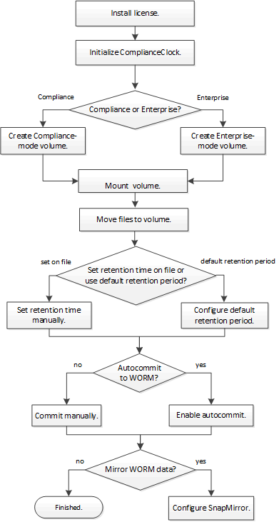

= SnapLock 워크플로
:allow-uri-read: 
:icons: font
:imagesdir: ../media/

[role="lead"]
SnapLock 볼륨을 생성할 때 사용할 SnapLock 모드, Compliance 모드 또는 Enterprise 모드를 지정합니다. 일반적으로 파일 아카이브 애플리케이션을 사용하여 파일을 운영 스토리지에서 SnapLock 볼륨으로 이동합니다.

