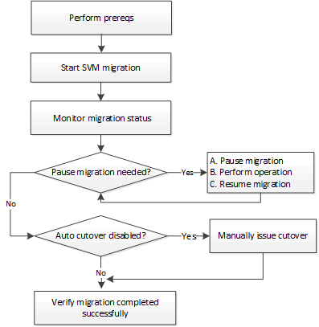

= SVM 데이터 이동성 개요
:allow-uri-read: 
:icons: font
:imagesdir: ../media/

[role="lead"]
ONTAP 9.10.1부터 클러스터 관리자는 SVM을 소스 클러스터에서 대상 클러스터로 중단 없이 재배치함으로써 용량과 로드 밸런싱을 관리하거나 ONTAP CLI를 사용하여 장비 업그레이드 또는 데이터 센터 통합을 지원할 수 있습니다.

이 무중단 SVM 재배치 기능은 ONTAP 9.10.1 및 9.11.1의 AFF 플랫폼에서 지원됩니다. ONTAP 9.12.1부터는 FAS 및 AFF 플랫폼, 하이브리드 애그리게이트 모두에서 이 기능이 지원됩니다.

마이그레이션 후에도 SVM의 이름과 UUID는 변경되지 않으며 데이터 LIF 이름, IP 주소, 볼륨 이름과 같은 개체 이름도 그대로 유지됩니다. SVM에서 개체의 UUID는 다릅니다.

== SVM 마이그레이션 워크플로우

이 다이어그램은 SVM 마이그레이션을 위한 일반적인 워크플로우를 보여 줍니다. 대상 클러스터에서 SVM 마이그레이션을 시작합니다. 소스 또는 대상에서 마이그레이션을 모니터링할 수 있습니다. 수동 컷오버나 자동 컷오버를 수행할 수 있습니다. 자동 컷오버는 기본적으로 수행됩니다.

== SVM 마이그레이션 플랫폼 지원

[cols="1,1"]
|===

| 컨트롤러 제품군 | ONTAP 버전이 지원됩니다 

| AFF A-시리즈 | ONTAP 9.10.1 이상 

| AFF C-시리즈 | ONTAP 9.12.1 패치 4 이상 

| FAS | ONTAP 9.12.1 이상 
|===

NOTE:  AFF 클러스터에서 하이브리드 애그리게이트가 포함된 FAS 클러스터로 마이그레이션할 경우, 자동 볼륨 배치를 통해 유사한 Aggregate 일치를 수행하려고 합니다. 예를 들어, 소스 클러스터에 60개의 볼륨이 있는 경우 볼륨 배치를 통해 타겟에서 AFF 애그리게이트를 찾아 볼륨을 배치합니다. AFF 애그리게이트에서 공간이 충분하지 않을 경우, 해당 볼륨은 플래시 디스크가 아닌 애그리게이트에 배치됩니다.

== ONTAP 버전별 확장성 지원

[cols="1,1"]
|===

| ONTAP 버전입니다 | 소스와 대상의 HA 쌍 

| ONTAP 9.14.1 | 12 

| ONTAP 9.13.1 | 6 

| ONTAP 9.11.1 | 3 

| ONTAP 9.10.1 | 1 
|===

== 소스와 대상 클러스터 간의 TCP RTT(Round Trip Time)에 대한 네트워크 인프라스트럭처 성능 요구 사항

클러스터에 설치된 ONTAP 버전에 따라 소스 및 대상 클러스터를 연결하는 네트워크의 왕복 시간이 그림과 같이 최대값이어야 합니다.

|===

| ONTAP 버전입니다 | 최대 RTT 

| ONTAP 9.12.1 이상 | 10ms 

| ONTAP 9.11.1 이전 버전 | 2ms 
|===

== SVM당 지원되는 최대 볼륨 수

[cols="1,1,1,1,1,1"]
|===

| 출처 | 목적지 | ONTAP 9.14.1 | ONTAP 9.13.1 | ONTAP 9.12.1 | ONTAP 9.11.1 이전 버전 

| AFF | AFF | 400 | 200 | 100 | 100 

| FAS | FAS | 80 | 80 | 80 | 해당 없음 

| FAS | AFF | 80 | 80 | 80 | 해당 없음 

| AFF | FAS | 80 | 80 | 80 | 해당 없음 
|===

== 필수 구성 요소

SVM 마이그레이션을 시작하기 전에 다음 사전 요구사항을 충족해야 합니다.

* 클러스터 관리자여야 합니다.
* link:https://docs.netapp.com/us-en/ontap/peering/create-cluster-relationship-93-later-task.html["소스 클러스터와 타겟 클러스터가 서로 피어링되어야 합니다"^].
* 소스 및 타겟 클러스터에 SnapMirror Synchronous 라이센스가 설치되어 있어야 합니다.
* 소스 클러스터의 모든 노드에서 ONTAP 9.10.1 이상이 실행되고 있어야 합니다. 특정 ONTAP 어레이 컨트롤러 지원에 대한 자세한 내용은 을 참조하십시오 link:https://hwu.netapp.com/["Hardware Universe"^].
* 소스 클러스터의 모든 노드에서 동일한 ONTAP 버전을 실행해야 합니다.
* 대상 클러스터의 모든 노드에서 동일한 ONTAP 버전을 실행해야 합니다.
* 대상 클러스터는 소스 클러스터와 같은 최신 주요 ECV(클러스터 버전)가 같거나 그보다 클 수 없습니다.
* 소스 및 타겟 클러스터가 데이터 LIF 액세스에 대해 동일한 IP 서브넷을 지원해야 합니다.
* 소스 SVM은 보다 적게 포함해야 합니다 xref:Maximum supported volumes per SVM[릴리스에 대해 지원되는 최대 데이터 볼륨 수입니다].
* 대상에서 볼륨 배치를 위한 충분한 공간을 사용할 수 있어야 합니다
* 소스 SVM에서 볼륨을 암호화한 경우 온보드 Key Manager를 타겟에 구성해야 합니다

== SVM 운영

SVM 마이그레이션과 충돌할 수 있는 작업을 확인해야 합니다.

* 진행 중인 페일오버 작업이 없습니다
* WAFLIRON을 실행할 수 없습니다
* 지문이 진행 중이 아닙니다
* 볼륨 이동, 리호스트, 클론, 생성, 변환 또는 분석이 실행되지 않습니다

== 지원 및 지원되지 않는 기능입니다

이 표에는 SVM 데이터 이동성이 지원하는 ONTAP 기능과 지원을 이용할 수 있는 ONTAP 릴리즈가 나와 있습니다.

[cols="3,1,4"]
|===

| 피처 | 첫 번째 릴리스가 지원됩니다 | 설명 

| 자율 랜섬웨어 보호 | ONTAP 9.12.1 |  

| Cloud Volumes ONTAP | 지원되지 않습니다 |  

| 외부 키 관리자 | ONTAP 9.11.1 |  

| FabricPool | ONTAP 9.11.1  a| 
에 대해 자세히 알아보십시오 xref:FabricPool support[FabricPool 지원].

| 팬아웃 관계(마이그레이션 소스에는 둘 이상의 대상이 있는 SnapMirror 소스 볼륨이 있음) | ONTAP 9.11.1 |  

| FC SAN | 지원되지 않습니다 |  

| Flash Pool을 참조하십시오 | ONTAP 9.12.1 |  

| FlexCache 볼륨 | 지원되지 않습니다 |  

| FlexGroup | 지원되지 않습니다 |  

| IPsec 정책 | 지원되지 않습니다 |  

| IPv6 LIF | 지원되지 않습니다 |  

| iSCSI SAN | 지원되지 않습니다 |  

| 작업 스케줄 복제 | ONTAP 9.11.1 | ONTAP 9.10.1에서는 마이그레이션 중에 작업 일정이 복제되지 않으므로 대상에서 수동으로 생성해야 합니다. ONTAP 9.11.1부터는 마이그레이션 중에 소스에서 사용하는 작업 일정이 자동으로 복제됩니다. 

| 로드 공유 미러 | 지원되지 않습니다 |  

| MetroCluster SVM | 지원되지 않습니다 | SVM 마이그레이션이 MetroCluster SVM 마이그레이션을 지원하지 않지만 에 SnapMirror 비동기식 복제를 사용할 수 있습니다 link:https://www.netapp.com/media/83785-tr-4966.pdf["MetroCluster 구성에서 SVM 마이그레이션"]. MetroCluster 구성에서 SVM 마이그레이션을 위해 설명된 프로세스는 무중단 방식이 _ 이(가) 아니라 _ 이라는 점에 유의해야 합니다. 

| NetApp 애그리게이트 암호화(NAE) | 지원되지 않습니다 | 암호화되지 않은 소스에서 암호화된 대상으로의 마이그레이션은 지원되지 않습니다. 

| NDMP 구성 | 지원되지 않습니다 |  

| NetApp 볼륨 암호화(NVE) | ONTAP 9.10.1 |  

| NFS 및 SMB 감사 로그 | ONTAP 9.13.1  a| 
[NOTE]
====
감사 로그 리디렉션은 클라우드 모드에서만 사용할 수 있습니다. 감사가 활성화된 온프레미스 SVM 마이그레이션의 경우 소스 SVM에 대한 감사를 비활성화한 다음 마이그레이션을 수행해야 합니다.

====
SVM 마이그레이션 전:

* link:https://docs.netapp.com/us-en/ontap/nas-audit/enable-disable-auditing-svms-task.html["감사 로그 리디렉션은 대상 클러스터에서 활성화해야 합니다"].
* link:https://docs.netapp.com/us-en/ontap/nas-audit/commands-modify-auditing-config-reference.html?q=audit+log+destination+path["소스 SVM의 감사 로그 대상 경로를 대상 클러스터에 생성해야 합니다"].

| NFS v3, NFS v4.1 및 NFS v4.2 | ONTAP 9.10.1 |  

| NFS v4.0 | ONTAP 9.12.1 |  

| pNFS를 사용하는 NFSv4.1 | ONTAP 9.14.1 |  

| NVMe over Fabric을 참조하십시오 | 지원되지 않습니다 |  

| 소스 클러스터에서 일반 조건 모드가 활성화된 온보드 키 관리자(OKM | 지원되지 않습니다 |  

| Qtree | ONTAP 9.14.1 |  

| 할당량 | ONTAP 9.14.1 |  

| S3 | 지원되지 않습니다 |  

| SMB 프로토콜 | ONTAP 9.12.1  a| 
SMB 마이그레이션은 무중단으로 수행 가능하며 마이그레이션 후 클라이언트 업데이트가 필요합니다.

| SnapMirror 비동기식 클라우드 복사 관계 | ONTAP 9.12.1 | ONTAP 9.12.1부터 SnapMirror 복사본 을 클라우드 관계로 SVM을 마이그레이션할 경우 타겟 클러스터에 COPY-TO-Cloud 라이센스가 설치되어 있어야 하며, 클라우드로 미러링되는 볼륨에서 용량 이동을 지원할 수 있는 충분한 용량이 있어야 합니다. 

| SnapMirror 비동기식 타겟 | ONTAP 9.12.1 |  

| SnapMirror 비동기식 소스 | ONTAP 9.11.1  a| 
* 대부분의 마이그레이션 동안 FlexVol SnapMirror 관계에서도 정상적으로 전송을 계속할 수 있습니다.
* 전환 중에 진행 중인 전송이 취소되고 전환 중에 새 전송이 실패하며 마이그레이션이 완료될 때까지 다시 시작할 수 없습니다.
* 마이그레이션 중에 취소되거나 누락된 예약된 전송은 마이그레이션이 완료된 후 자동으로 시작되지 않습니다.
+
[NOTE]
====
SnapMirror 소스가 마이그레이션되면 ONTAP에서 SnapMirror 업데이트가 수행될 때까지 마이그레이션 후에 볼륨이 삭제되지 않도록 합니다. 이는 마이그레이션된 SnapMirror 소스 볼륨에 대한 SnapMirror 관련 정보는 마이그레이션이 완료된 후와 첫 번째 업데이트가 완료된 후에만 사용할 수 있기 때문입니다.

====

| SMTape 설정 | 지원되지 않습니다 |  

| SnapLock | 지원되지 않습니다 |  

| SnapMirror 비즈니스 연속성 | 지원되지 않습니다 |  

| SnapMirror SVM 피어 관계 | ONTAP 9.12.1 |  

| SnapMirror SVM 재해 복구 | 지원되지 않습니다 |  

| SnapMirror Synchronous | 지원되지 않습니다 |  

| 스냅샷 복사본 | ONTAP 9.10.1 |  

| 스냅샷 복사본의 무단 잠금 방지 | ONTAP 9.14.1 | 변조 방지 스냅샷 복사본 잠금은 SnapLock과 동일하지 않습니다. SnapLock는 지원되지 않습니다. 

| 가상 IP LIF/BGP | 지원되지 않습니다 |  

| Virtual Storage Console 7.0 이상 | 지원되지 않습니다 | VSC는 의 일부입니다 https://docs.netapp.com/us-en/ontap-tools-vmware-vsphere/index.html["VMware vSphere 가상 어플라이언스인 ONTAP 툴"^] VSC 7.0부터 시작합니다. 

| 볼륨 클론 | 지원되지 않습니다 |  

| vStorage | 지원되지 않습니다 |  
|===

=== FabricPool 지원

SVM 마이그레이션은 FabricPool의 볼륨에서 다음 플랫폼용 지원됩니다.

* Azure NetApp Files 플랫폼: 모든 계층화 정책이 지원됩니다(스냅샷 전용, 자동, 모두 및 없음).
* 온프레미스 플랫폼: "없음" 볼륨 계층화 정책만 지원됩니다.

== 마이그레이션 중 지원되는 작업

다음 표에는 마이그레이션 상태에 따라 마이그레이션 SVM 내에서 지원되는 볼륨 작업이 나와 있습니다.

[cols="2,1,1,1"]
|===

| 볼륨 작업입니다 3+| SVM 마이그레이션 상태 

|  | * 진행 중 * | * 일시 중지됨 * | * 컷오버 * 

| 생성 | 허용되지 않습니다 | 허용됨 | 지원되지 않습니다 

| 삭제 | 허용되지 않습니다 | 허용됨 | 지원되지 않습니다 

| File System Analytics가 해제되었습니다 | 허용됨 | 허용됨 | 지원되지 않습니다 

| File System Analytics가 설정되었습니다 | 허용되지 않습니다 | 허용됨 | 지원되지 않습니다 

| 수정 | 허용됨 | 허용됨 | 지원되지 않습니다 

| 오프라인/온라인 | 허용되지 않습니다 | 허용됨 | 지원되지 않습니다 

| 이동/재호스팅 | 허용되지 않습니다 | 허용됨 | 지원되지 않습니다 

| Qtree 생성/수정 | 허용되지 않습니다 | 허용됨 | 지원되지 않습니다 

| 할당량 생성/수정 | 허용되지 않습니다 | 허용됨 | 지원되지 않습니다 

| 이름 바꾸기 | 허용되지 않습니다 | 허용됨 | 지원되지 않습니다 

| 크기 조정 | 허용됨 | 허용됨 | 지원되지 않습니다 

| 제한 | 허용되지 않습니다 | 허용됨 | 지원되지 않습니다 

| 스냅샷 복사본 속성이 수정됩니다 | 허용됨 | 허용됨 | 지원되지 않습니다 

| 스냅샷 복사본 자동 삭제 수정 | 허용됨 | 허용됨 | 지원되지 않습니다 

| 스냅샷 복사본 생성 | 허용됨 | 허용됨 | 지원되지 않습니다 

| 스냅샷 복사본 삭제 | 허용됨 | 허용됨 | 지원되지 않습니다 

| 스냅샷 복사본에서 파일을 복원합니다 | 허용됨 | 허용됨 | 지원되지 않습니다 
|===
다음 표에는 마이그레이션 상태에 따라 마이그레이션 SVM 내에서 지원되는 파일 작업이 나와 있습니다.

[cols="2,1,1,1"]
|===

| 파일 작업 3+| SVM 마이그레이션 상태 

|  | * 진행 중 * | * 일시 중지됨 * | * 컷오버 * 

| 비동기 삭제 | 허용되지 않습니다 | 허용되지 않습니다 | 지원되지 않습니다 

| 클론 생성/삭제/분할 | 허용됨 | 허용됨 | 지원되지 않습니다 

| 수정/삭제 복사 | 허용되지 않습니다 | 허용되지 않습니다 | 지원되지 않습니다 

| 이동 | 허용되지 않습니다 | 허용되지 않습니다 | 지원되지 않습니다 

| 예약 | 허용됨 | 허용됨 | 지원되지 않습니다 
|===