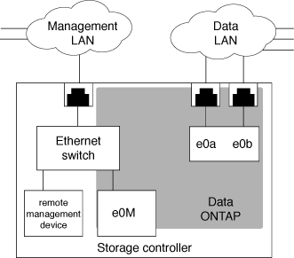

= 관리 네트워크 트래픽을 격리합니다
:allow-uri-read: 
:icons: font
:imagesdir: ../media/

[role="lead"]
관리 트래픽 전용 서브넷에 SP/BMC 및 e0M 관리 인터페이스를 구성하는 것이 좋습니다. 관리 네트워크를 통해 데이터 트래픽을 실행하면 성능 저하 및 라우팅 문제가 발생할 수 있습니다.

대부분의 스토리지 컨트롤러의 관리 이더넷 포트(섀시 뒤쪽에 렌치 아이콘으로 표시됨)는 내부 이더넷 스위치에 연결됩니다. 내부 스위치는 SP/BMC 및 e0M 관리 인터페이스에 대한 연결을 제공하며, 이 인터페이스를 사용하여 텔넷, SSH 및 SNMP와 같은 TCP/IP 프로토콜을 통해 스토리지 시스템에 액세스할 수 있습니다.

원격 관리 장치와 e0M을 모두 사용하려는 경우 동일한 IP 서브넷에 구성해야 합니다. 이러한 인터페이스는 대역폭이 낮은 인터페이스이므로 관리 트래픽 전용 서브넷에 SP/BMC 및 e0M을 구성하는 것이 좋습니다.

관리 트래픽을 격리할 수 없거나 전용 관리 네트워크가 비정상적으로 큰 경우 네트워크 트래픽 볼륨을 가능한 낮게 유지해야 합니다. 브로드캐스트 또는 멀티캐스트 트래픽이 과도하게 유입될 경우 SP/BMC 성능이 저하될 수 있습니다.

[NOTE]
====
AFF A800과 같은 일부 스토리지 컨트롤러에는 BMC용 포트 2개와 e0M용 포트 1개가 있습니다. 이러한 컨트롤러의 경우 동일한 IP 서브넷에 BMC 및 e0M을 구성할 필요가 없습니다.

====