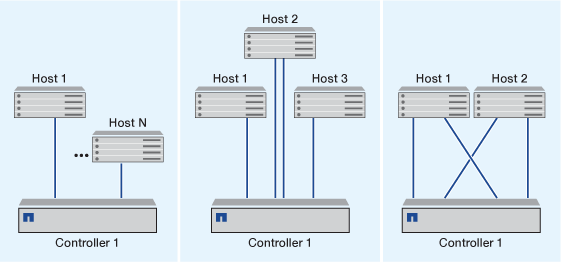
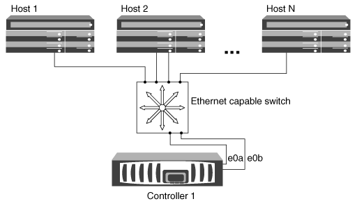
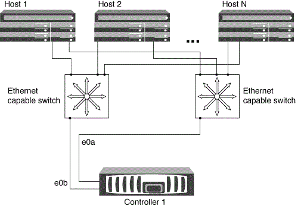
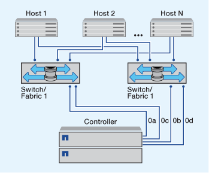

= 단일 노드 클러스터를 관리합니다
:allow-uri-read: 
:icons: font
:imagesdir: ../media/

[role="lead"]
단일 노드 클러스터는 독립 실행형 노드에서 실행되는 클러스터의 특수한 구현입니다.  단일 노드 클러스터는 이중화를 제공하지 않기 때문에 권장되지 않습니다.  노드가 다운되면 데이터 액세스가 손실됩니다.

[NOTE]
====
내결함성 및 무중단 운영을 위해 클러스터를 구성하는 것이 좋습니다 link:../concepts/high-availability-pairs-concept.html["고가용성(HA 쌍)"].

====
단일 노드 클러스터를 구성하거나 업그레이드하도록 선택하는 경우 다음 사항에 유의해야 합니다.

* 루트 볼륨 암호화는 단일 노드 클러스터에서 지원되지 않습니다.
* 단일 노드 클러스터를 가지고 있는 노드를 제거하는 경우 클러스터 포트를 데이터 포트로 수정한 다음 데이터 포트에 데이터 LIF를 생성하여 데이터 트래픽을 서비스하도록 클러스터 포트를 수정해야 합니다.
* 단일 노드 클러스터의 경우 소프트웨어 설치 중에 구성 백업 대상을 지정할 수 있습니다. 설정 후 ONTAP 명령을 사용하여 이러한 설정을 수정할 수 있습니다.
* 노드에 접속하는 호스트가 여러 개인 경우 각 호스트를 Windows 또는 Linux와 같은 다른 운영 체제로 구성할 수 있습니다. 호스트에서 컨트롤러로의 경로가 여러 개인 경우 호스트에서 ALUA를 활성화해야 합니다.

== 단일 노드로 iSCSI SAN 호스트를 구성하는 방법

iSCSI SAN 호스트를 단일 노드에 직접 연결하거나 하나 이상의 IP 스위치를 통해 연결하도록 구성할 수 있습니다. 노드는 스위치에 대한 여러 iSCSI 연결을 가질 수 있습니다.

.직접 연결 단일 노드 구성
직접 연결된 단일 노드 구성에서는 하나 이상의 호스트가 노드에 직접 연결됩니다.

.단일 네트워크 단일 노드 구성
단일 네트워크 단일 노드 구성에서는 하나의 스위치를 하나 이상의 호스트에 연결합니다. 단일 스위치가 있으므로 이 구성은 완전히 중복되지 않습니다.

.다중 네트워크 단일 노드 구성
다중 네트워크 단일 노드 구성에서는 두 개 이상의 스위치가 단일 노드를 하나 이상의 호스트에 연결합니다. 스위치가 여러 개 있으므로 이 구성은 완전히 중복됩니다.

== 단일 노드로 FC 및 FC-NVMe SAN 호스트를 구성하는 방법

하나 이상의 패브릭을 통해 단일 노드로 FC 및 FC-NVMe SAN 호스트를 구성할 수 있습니다. N-포트 ID 가상화(NPIV)가 필요하며 Fabric의 모든 FC 스위치에서 활성화해야 합니다. FC 스위치를 사용하지 않고 FC 또는 FC-NMVE SAN 호스트를 단일 노드에 직접 연결할 수는 없습니다.

.단일 패브릭 단일 노드 구성
단일 패브릭 단일 노드 구성에서는 단일 노드를 하나 이상의 호스트에 연결하는 하나의 스위치가 있습니다. 단일 스위치가 있으므로 이 구성은 완전히 중복되지 않습니다.

단일 패브릭 단일 노드 구성에서는 호스트에서 노드로 연결되는 단일 경로만 있으면 다중 경로 소프트웨어가 필요하지 않습니다.

.멀티패브릭 단일 노드 구성
다중 패브릭 단일 노드 구성에는 단일 노드를 하나 이상의 호스트에 연결하는 스위치가 2개 이상 있습니다. 다음 그림은 간소화를 위해 두 개의 패브릭만 있는 다중 패브릭 단일 노드 구성을 보여 주며 여러 개의 패브릭 구성에서 두 개 이상의 패브릭을 사용할 수 있습니다. 이 그림에서 스토리지 컨트롤러는 상단 섀시에 마운트되며, 하단 섀시는 이 예제에서와 같이 비어 있거나 IOMX 모듈이 있을 수 있습니다.

그림의 FC 타겟 포트(0a, 0c, 0b, 0d)가 예제입니다. 실제 포트 번호는 스토리지 노드의 모델 및 확장 어댑터를 사용하고 있는지에 따라 다릅니다.

.관련 정보
http://www.netapp.com/us/media/tr-4684.pdf["NetApp 기술 보고서 4684: NVMe-oF를 사용하여 최신 SAN 구현 및 구성"^]

== 단일 노드 클러스터에 대한 ONTAP 업그레이드

ONTAP 9.2부터는 ONTAP CLI를 사용하여 단일 노드 클러스터에 대한 자동 업데이트를 수행할 수 있습니다. 단일 노드 클러스터에는 중복성이 없으므로 업데이트가 항상 중단될 수 있습니다. System Manager를 사용하여 운영 중단 업그레이드를 수행할 수 없습니다.

.시작하기 전에
업그레이드를 완료해야 합니다 link:../upgrade/prepare.html["준비"] 단계.

.단계
. 이전 ONTAP 소프트웨어 패키지를 삭제합니다.
+
[source, cli]
----
cluster image package delete -version previous_package_version
----
. 대상 ONTAP 소프트웨어 패키지를 다운로드합니다.
+
[source, cli]
----
cluster image package get -url location
----
+
[listing]
----
cluster1::> cluster image package get -url http://www.example.com/software/9.7/image.tgz

Package download completed.
Package processing completed.
----
. 소프트웨어 패키지를 클러스터 패키지 리포지토리에서 사용할 수 있는지 확인합니다.
+
[source, cli]
----
cluster image package show-repository
----
+
[listing]
----
cluster1::> cluster image package show-repository
Package Version  Package Build Time
---------------- ------------------
9.7              M/DD/YYYY 10:32:15
----
. 클러스터를 업그레이드할 준비가 되었는지 확인합니다.
+
[source, cli]
----
cluster image validate -version package_version_number
----
+
[listing]
----
cluster1::> cluster image validate -version 9.7

WARNING: There are additional manual upgrade validation checks that must be performed after these automated validation checks have completed...
----
. 검증 진행 상황 모니터링:
+
[source, cli]
----
cluster image show-update-progress
----
. 검증에서 식별된 모든 필수 조치를 완료하십시오.
. 필요한 경우 소프트웨어 업그레이드 예상치를 생성합니다.
+
[source, cli]
----
cluster image update -version package_version_number -estimate-only
----
+
소프트웨어 업그레이드 추정치는 업데이트할 각 구성 요소에 대한 세부 정보와 예상 업그레이드 기간을 표시합니다.

. 소프트웨어 업그레이드 수행:
+
[source, cli]
----
cluster image update -version package_version_number
----
+

NOTE: 문제가 발생하면 업데이트가 일시 중지되고 수정 조치를 취하라는 메시지가 표시됩니다. 클러스터 image show-update-progress 명령을 사용하여 문제 및 업데이트 진행 상황에 대한 세부 정보를 볼 수 있습니다. 문제를 해결한 후 cluster image resume-update 명령을 사용하여 업데이트를 다시 시작할 수 있습니다.

. 클러스터 업데이트 진행률을 표시합니다.
+
[source, cli]
----
cluster image show-update-progress
----
+
노드가 업데이트의 일부로 재부팅되며 재부팅 중에 액세스할 수 없습니다.

. 알림 트리거:
+
[source, cli]
----
autosupport invoke -node * -type all -message "Finishing_Upgrade"
----
+
클러스터가 메시지를 전송하도록 구성되지 않은 경우 알림 복사본이 로컬에 저장됩니다.

