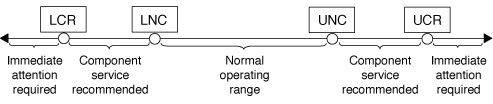

= 시스템 센서 명령 출력의 임계값 기반 SP 센서 판독값과 상태 값에 대해 설명합니다
:allow-uri-read: 
:icons: font
:imagesdir: ../media/

[role="lead"]
임계값 기반 센서는 다양한 시스템 구성 요소의 판독값을 주기적으로 읽습니다. SP는 임계값 기반 센서의 판독값을 구성 요소의 허용 가능한 작동 조건을 정의하는 사전 설정된 임계값 제한과 비교합니다.

센서에서 읽은 정보를 기반으로 SP는 사용자가 해당 구성 요소의 상태를 모니터링할 수 있도록 센서 상태를 표시합니다.

임계값 기반 센서의 예로 시스템 온도 센서, 전압 센서, 전류 센서 및 팬 속도 센서가 있습니다. 특정 임계값 기반 센서 목록은 플랫폼에 따라 다릅니다.

임계값 기반 센서의 경우 SP 'system sensors' 명령의 출력에 표시되는 임계값은 다음과 같습니다.

* 하한 위험(LCR)
* 하한 비위험(LNC)
* 상한 비위험(UNC)
* 상한 위험(UCR)

센서 상태가 LNC와 LCR 사이이거나 UNC와 UCR 사이일 경우, 해당 구성 요소에 문제의 징후가 있고 그 결과 시스템 장애가 발생할 수 있음을 나타냅니다. 따라서 빨리 구성 요소 서비스 계획을 세워야 합니다.

센서 상태가 LCR보다 낮거나 UCR보다 높을 경우 해당 구성 요소가 오작동 중이며 시스템 장애가 곧 발생할 수 있음을 나타냅니다. 따라서 구성 요소에 즉각적인 주의가 필요합니다.

다음 다이어그램에서는 임계값에 의해 지정된 심각도 범위를 보여 줍니다.

'시스템 센서' 명령 출력의 Current' 열에서 임계값 기반 센서의 판독값을 확인할 수 있습니다. 시스템 센서의 get' sensor_name' 명령은 지정된 센서에 대한 추가 세부 정보를 표시합니다. 임계값 기반 센서의 판독값이 비위험 임계값 범위와 임계 임계값 범위를 넘어가면 센서에서 심각도가 증가하는 문제를 보고합니다. 값이 임계값 제한을 초과하면 '시스템 센서' 명령 출력의 센서 상태가 'ok'에서 'nc'(비위험) 또는 'cr'(위험)로 변경되고 이벤트 메시지가 SEL 이벤트 로그에 기록됩니다.

일부 임계값 기반 센서의 경우 네 가지 임계값 중 일부가 없습니다. 이러한 센서의 경우 누락된 임계값은 '시스템 센서' 명령 출력에서 해당 제한값으로 'na'가 표시됩니다. 이는 특정 센서의 임계값 관련 제한이나 심각도가 없고 SP가 센서에서 해당 임계값을 모니터링하지 않음을 나타냅니다.

다음 예제는 SP CLI에서 'system sensors' 명령으로 표시되는 일부 정보를 보여 줍니다.

[listing]
----
SP node1> system sensors

Sensor Name      | Current    | Unit       | Status| LCR       | LNC       | UNC       | UCR
-----------------+------------+------------+-------+-----------+-----------+-----------+-----------
CPU0_Temp_Margin | -55.000    | degrees C  | ok    | na        | na        | -5.000    | 0.000
CPU1_Temp_Margin | -56.000    | degrees C  | ok    | na        | na        | -5.000    | 0.000
In_Flow_Temp     | 32.000     | degrees C  | ok    | 0.000     | 10.000    | 42.000    | 52.000
Out_Flow_Temp    | 38.000     | degrees C  | ok    | 0.000     | 10.000    | 59.000    | 68.000
CPU1_Error       | 0x0        | discrete   | 0x0180| na        | na        | na        | na
CPU1_Therm_Trip  | 0x0        | discrete   | 0x0180| na        | na        | na        | na
CPU1_Hot         | 0x0        | discrete   | 0x0180| na        | na        | na        | na
IO_Mid1_Temp     | 30.000     | degrees C  | ok    | 0.000     | 10.000    | 55.000    | 64.000
IO_Mid2_Temp     | 30.000     | degrees C  | ok    | 0.000     | 10.000    | 55.000    | 64.000
CPU_VTT          | 1.106      | Volts      | ok    | 1.028     | 1.048     | 1.154     | 1.174
CPU0_VCC         | 1.154      | Volts      | ok    | 0.834     | 0.844     | 1.348     | 1.368
3.3V             | 3.323      | Volts      | ok    | 3.053     | 3.116     | 3.466     | 3.546
5V               | 5.002      | Volts      | ok    | 4.368     | 4.465     | 5.490     | 5.636
STBY_1.8V        | 1.794      | Volts      | ok    | 1.678     | 1.707     | 1.892     | 1.911
…
----
다음 예제는 임계값 기반 센서 5V에 대해 SP CLI에서 시스템 센서의 get' sensor_name을 입력한 결과를 보여줍니다.

[listing]
----
SP node1> system sensors get 5V

Locating sensor record...
Sensor ID              : 5V (0x13)
 Entity ID             : 7.97
 Sensor Type (Analog)  : Voltage
 Sensor Reading        : 5.002 (+/- 0) Volts
 Status                : ok
 Lower Non-Recoverable : na
 Lower Critical        : 4.246
 Lower Non-Critical    : 4.490
 Upper Non-Critical    : 5.490
 Upper Critical        : 5.758
 Upper Non-Recoverable : na
 Assertion Events      :
 Assertions Enabled    : lnc- lcr- ucr+
 Deassertions Enabled  : lnc- lcr- ucr+
----