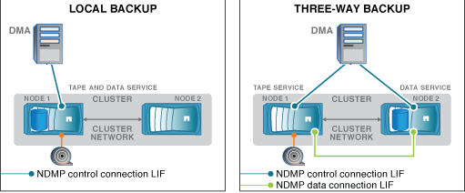

= 선호도 정보의 정의
:allow-uri-read: 
:icons: font
:imagesdir: ../media/

[role="lead"]
백업 애플리케이션이 CAB을 인식하면 NDMP 서버가 볼륨 및 테이프 디바이스에 대한 고유한 위치 정보를 제공합니다. 볼륨과 테이프 디바이스가 동일한 선호도를 공유하는 경우 이러한 선호도 정보를 사용하여 백업 애플리케이션이 3방향 백업 대신 로컬 백업을 수행할 수 있습니다.

노드 관리 LIF, 클러스터 관리 LIF에서 NDMP 제어 연결을 설정할 경우 또는 인터클러스터 LIF에서 백업 애플리케이션에서는 선호도 정보를 사용하여 볼륨 및 테이프 장치가 동일한 노드에 있는지 확인한 다음 로컬 또는 3방향 백업 또는 복원 작업을 수행할 수 있습니다. 데이터 LIF에서 NDMP 제어 연결이 설정되면 백업 애플리케이션이 항상 3방향 백업을 수행합니다.

== 로컬 NDMP 백업 및 3방향 NDMP 백업

DMA(백업 애플리케이션)는 볼륨 및 테이프 디바이스에 대한 선호도 정보를 사용하여 클러스터의 노드 1에 있는 볼륨 및 테이프 디바이스에 대해 로컬 NDMP 백업을 수행합니다. 볼륨이 노드 1에서 노드 2로 이동하는 경우 볼륨 및 테이프 디바이스에 대한 선호도 정보가 변경됩니다. 따라서 후속 백업을 위해 DMA는 3방향 NDMP 백업 작업을 수행합니다. 이렇게 하면 볼륨이 이동되는 노드에 관계없이 볼륨에 대한 백업 정책의 연속성을 보장할 수 있습니다.

.관련 정보
xref:cluster-aware-backup-extension-concept.adoc[Cluster Aware Backup 확장의 기능]
