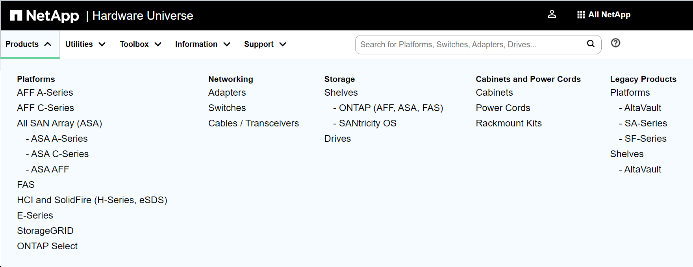
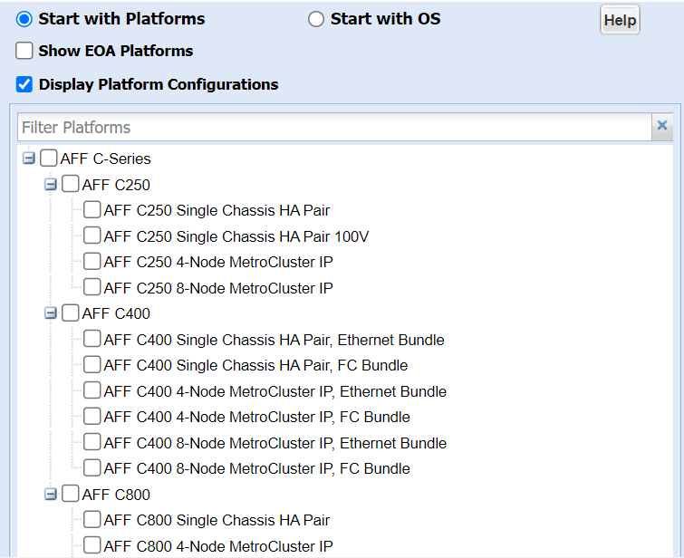
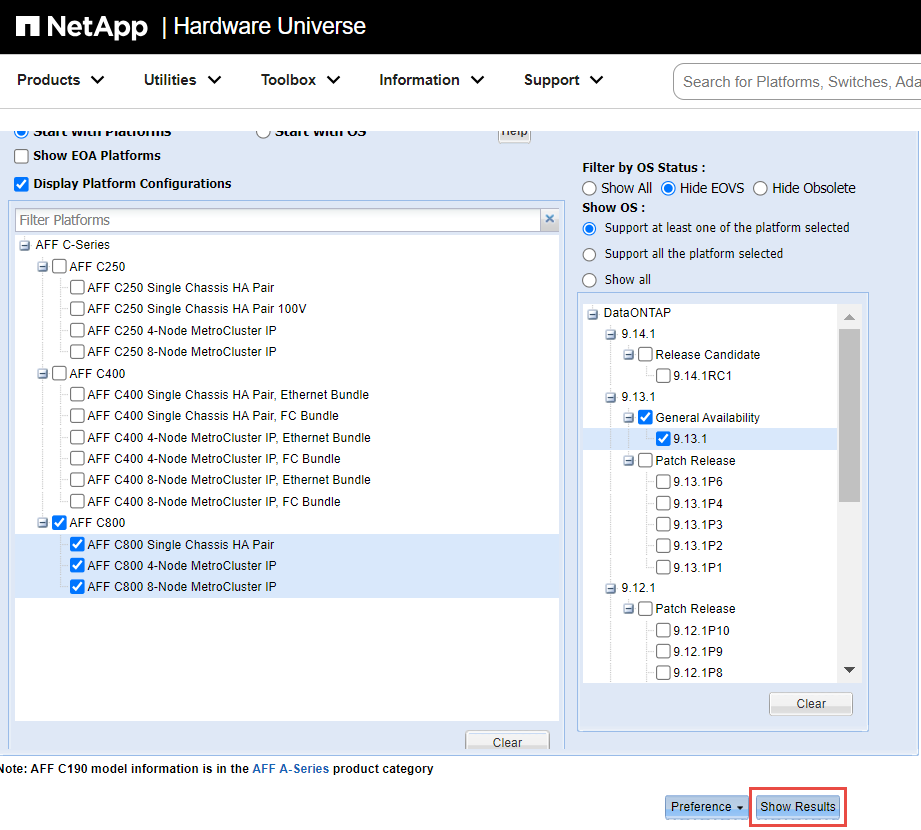

= 보관 제한
:allow-uri-read: 
:icons: font
:imagesdir: ../media/

[role="lead"]
스토리지 아키텍처를 계획 및 관리할 때 고려해야 할 스토리지 개체에 대한 제한이 있습니다.

제한은 플랫폼에 따라 다릅니다. 을 참조하십시오 link:https://hwu.netapp.com/["NetApp Hardware Universe를 참조하십시오"^] 특정 구성에 대한 제한 사항을 알아봅니다. 을 참조하십시오 <<hwu>> ONTAP 구성에 적합한 정보를 식별하는 방법에 대한 지침을 참조하십시오.

제한 사항은 다음 섹션에 나와 있습니다.

* <<vollimits>>
* <<flexclone>>

Cloud Volumes ONTAP에 대한 스토리지 제한은 에 설명되어 있습니다 link:https://docs.netapp.com/us-en/cloud-volumes-ontap/["Cloud Volumes ONTAP 릴리즈 노트"^].

== 볼륨 제한

[cols="4*"]
|===
| 스토리지 객체 | 제한 | 네이티브 스토리지 | 지원합니다 

 a| 
스토리지 LUN *
 a| 
루트 볼륨 ^1^의 최소 크기입니다
 a| 
해당 없음
 a| 
모델에 따라 다름

 a| 
* 파일 *
 a| 
최대 크기
 a| 
버전에 따라 다릅니다
 a| 
버전에 따라 다릅니다

 a| 
볼륨당 최대 4도
 a| 
볼륨 크기에 따라 다름, 최대 20억
 a| 
볼륨 크기에 따라 다름, 최대 20억

 a| 
FlexClone 볼륨 *
 a| 
계층적 복제 깊이 5
 a| 
499
 a| 
499

 a| 
* FlexVol 볼륨 *
 a| 
노드당 최대 ^1^
 a| 
모델에 따라 다름
 a| 
모델에 따라 다름

 a| 
SVM당 최대 노드 수 6개
 a| 
모델에 따라 다름
 a| 
모델에 따라 다름

 a| 
최소 크기
 a| 
20MB
 a| 
20MB

 a| 
최대 크기 ^1^
 a| 
모델에 따라 다름
 a| 
모델에 따라 다름

 a| 
* 운영 워크로드용 FlexVol 볼륨 *
 a| 
노드 당 최대 3개
 a| 
모델에 따라 다름
 a| 
모델에 따라 다름

 a| 
* FlexVol 루트 볼륨 *
 a| 
최소 크기 ^1^
 a| 
모델에 따라 다름
 a| 
모델에 따라 다름

 a| 
LUN *
 a| 
노드 당 최대 6개
 a| 
모델에 따라 다름
 a| 
모델에 따라 다름

 a| 
클러스터 당 최대 6개
 a| 
모델에 따라 다름
 a| 
모델에 따라 다름

 a| 
볼륨당 최대 ^6^
 a| 
모델에 따라 다름
 a| 
모델에 따라 다름

 a| 
최대 크기
 a| 
버전에 따라 다릅니다
 a| 
버전에 따라 다릅니다

 a| 
* qtree *
 a| 
FlexVol 볼륨당 최대
 a| 
4,995
 a| 
4,995

 a| 
Snapshot 복사본 *
 a| 
볼륨당 최대 7도
 a| 
255/1023
 a| 
255/1023

 a| 
볼륨 *
 a| 
NAS의 경우 클러스터당 최대 수
 a| 
12,000
 a| 
12,000

 a| 
SAN 프로토콜이 구성된 클러스터당 최대 수
 a| 
모델에 따라 다름
 a| 
모델에 따라 다름

|===
* 참고: *

. ONTAP 9.3 이전 버전에서는 볼륨에 최대 255개의 스냅샷 복사본이 포함될 수 있습니다. ONTAP 9.4 이상에서는 볼륨에 최대 1023개의 스냅샷 복사본을 포함할 수 있습니다.
. ONTAP 9.12.1P2부터 128TB가 제한됩니다. ONTAP 9.11.1 이하 버전에서는 16TB로 제한됩니다.
. ONTAP 9.7부터 128GB 이상의 메모리가 있는 AFF 플랫폼에서 지원되는 최대 FlexVol 볼륨 수가 노드당 2,500개의 FlexVol 볼륨으로 증가했습니다.
+
플랫폼별 정보 및 최신 지원 정보는 를 참조하십시오 https://hwu.netapp.com/["Hardware Universe"^].

. 20억 = 2 × 10^9^.
. 단일 FlexVol 볼륨에서 생성할 수 있는 FlexClone 볼륨의 중첩 계층 구조의 최대 깊이
. 이 제한은 SAN 환경에서만 적용됩니다.
+
link:../san-config/index.html["SAN 구성"]

. SnapMirror 계단식 구축을 사용하여 이 제한을 늘릴 수 있습니다.

== FlexClone 파일 및 FlexClone LUN 제한

[cols="3*"]
|===
| 제한 | 네이티브 스토리지 | 지원합니다 

 a| 
** 파일 또는 LUN당 최대 ** ^1^
 a| 
32,767입니다
 a| 
32,767입니다

 a| 
* FlexVol 볼륨당 최대 총 공유 데이터 *
 a| 
640TB
 a| 
640TB

|===
* 참고: *

. 32,767개 이상의 클론을 생성하려고 하면 ONTAP에서 자동으로 상위 파일 또는 LUN의 새 물리적 복사본을 생성합니다.
+
중복 제거를 사용하는 FlexVol 볼륨의 경우 이 제한이 낮아질 수 있습니다.

== NetApp Hardware Universe 탐색

플랫폼별 및 모델별 제한을 찾으려면 을 참조하십시오 link:https://hwu.netapp.com/["NetApp Hardware Universe를 참조하십시오"^].

.단계
. 제품** 드롭다운 메뉴에서 하드웨어 구성을 선택합니다.
+

. 플랫폼을 선택합니다.
+

. 적절한 ONTAP 버전을 선택한 다음 ** 결과 표시** 를 선택합니다.
+

.관련 정보
https://www.netapp.com/cloud-services/cloud-manager/documentation/["사용 중인 Cloud Volumes ONTAP 버전에 대한 릴리즈 노트를 참조하십시오"]
