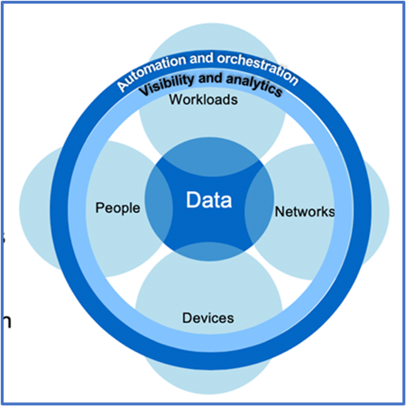

= ONTAP로 제로 트러스트에 대한 데이터 중심 접근 방식 설계
:allow-uri-read: 
:icons: font
:imagesdir: ../media/

[role="lead"]
제로 트러스트 네트워크는 데이터 중심 접근 방식으로 정의되며, 보안 제어는 데이터와 최대한 가까운 위치에 있어야 합니다. ONTAP의 기능을 NetApp FPolicy 파트너 에코시스템과 결합하여 데이터 중심 제로 트러스트 모델에 필요한 제어 기능을 제공할 수 있습니다.

ONTAP는 NetApp의 보안이 풍부한 데이터 관리 소프트웨어이며, FPolicy 제로 트러스트 엔진은 세부적인 파일 기반 이벤트 알림 인터페이스를 제공하는 업계 최고의 ONTAP 기능입니다. NetApp FPolicy 파트너는 이 인터페이스를 사용하여 ONTAP 내의 데이터 액세스를 더욱 잘 파악할 수 있습니다.

== 제로 트러스트 데이터 중심 MCAP 설계

데이터 중심의 제로 트러스트 MCAP를 설계하려면 다음 단계를 따르십시오.

. 모든 조직 데이터의 위치를 식별합니다.
. 데이터를 분류합니다.
. 더 이상 필요하지 않은 데이터는 안전하게 폐기합니다.
. 데이터 분류에 액세스해야 하는 역할을 이해합니다.
. 최소 권한 원칙을 적용하여 액세스 제어를 적용합니다.
. 관리 액세스 및 데이터 액세스에 다단계 인증을 사용하십시오.
. 유휴 데이터와 사용 중인 데이터에 암호화 사용
. 모든 액세스를 모니터링하고 기록합니다.
. 의심스러운 액세스 또는 행동을 경고합니다.

=== 모든 조직 데이터의 위치를 식별합니다

ONTAP의 FPolicy 기능과 FPolicy 파트너의 NetApp 제휴 파트너 에코시스템과 결합하여 조직의 데이터가 어디에 있고 누가 액세스하는지를 파악할 수 있습니다. 이 작업은 데이터 액세스 패턴의 유효성 여부를 식별하는 사용자 행동 분석을 통해 수행됩니다. 사용자 행동 분석에 대한 자세한 내용은 모든 액세스 모니터링 및 로그에서 설명합니다. 데이터가 어디에 있고 누가 데이터에 액세스할 수 있는지 모르는 경우 사용자 행동 분석을 통해 경험적 관찰을 통해 분류 및 정책을 수립할 수 있습니다.

=== 데이터를 분류합니다

Zero Trust 모델 용어에서 데이터 분류에는 독성 데이터의 식별이 포함됩니다. 독성 데이터는 조직 외부에 노출되지 않도록 설계된 중요 데이터입니다. 독성 데이터를 공개하면 규정 준수 위반을 초래하고 조직의 평판을 훼손할 수 있습니다. 규정 준수 측면에서 독성 데이터에는 에 대한 카드 소유자 데이터 https://www.netapp.com/us/media/tr-4401.pdf["PCI-DSS(Payment Card Industry Data Security Standard)"^], EU의 개인 데이터 https://www.netapp.com/us/info/gdpr.aspx["일반 데이터 보호 규정(GDPR)"^]또는 에 대한 의료 데이터가 https://www.hhs.gov/hipaa/for-professionals/privacy/laws-regulations/index.html["HIPAA(Health Insurance Portability and Accountability Act)"^]포함됩니다. AI 기반 툴킷인 NetApp(이전의 Cloud Data Sense)를 사용하여 데이터를 자동으로 스캔, 분석, 범주화할 수 있습니다 https://bluexp.netapp.com/netapp-cloud-data-sense["BlueXP 분류"^] .

=== 더 이상 필요하지 않은 데이터는 안전하게 폐기합니다

조직의 데이터를 분류한 후 일부 데이터가 더 이상 필요하지 않거나 조직의 기능과 관련이 없다는 것을 알게 될 수 있습니다. 불필요한 데이터의 보유는 책임이며, 그러한 데이터는 삭제되어야 한다. 데이터를 암호화하여 삭제하는 고급 메커니즘은 저장된 데이터 암호화의 보안 삭제 설명을 참조하십시오.

=== 데이터 분류에 액세스해야 하는 역할을 이해하고 액세스 제어를 적용하기 위해 최소 권한 원칙을 적용합니다

중요한 데이터에 대한 액세스를 매핑하고 최소 권한 원칙을 적용하면 조직 내 사용자가 작업을 수행하는 데 필요한 데이터만 액세스할 수 있습니다. 이 프로세스에는 역할 기반 액세스 제어가 포함되는데, 이 제어는 (https://docs.netapp.com/us-en/ontap/authentication/index.html["RBAC"^]데이터 액세스 및 관리 액세스에 적용됩니다.

ONTAP를 사용하면 스토리지 가상 머신(SVM)을 ONTAP 클러스터 내의 테넌트가 조직 데이터 액세스를 분할하는 데 사용할 수 있습니다. RBAC는 데이터 액세스뿐만 아니라 SVM에 대한 관리 액세스에도 적용할 수 있습니다. RBAC는 클러스터 관리 레벨에서 적용할 수도 있습니다.

RBAC와 더불어 MAV(ONTAP)를 사용하면 한 명 이상의 관리자가 또는 같은 명령을 승인하도록 할 수 있습니다 link:../multi-admin-verify/index.html["다중 관리자 인증"] `volume delete` `volume snapshot delete`. MAV가 활성화되면 MAV를 수정하거나 사용하지 않도록 하려면 MAV 관리자의 승인이 필요합니다.

ONTAP를 사용하여 스냅샷 복사본을 보호하는 또 다른 link:../snaplock/snapshot-lock-concept.html["스냅샷 복사본 잠금"]방법입니다. 스냅샷 복사본 잠금은 볼륨 스냅샷 복사본 정책에 대한 보존 기간을 두고 수동으로 또는 자동으로 스냅샷 복사본을 지울 수 없는 SnapLock 기능입니다. 스냅샷 복사본 잠금은 무단 조작 방지 스냅샷 복사본 잠금이라고도 합니다. 스냅샷 복사본 잠금의 목적은 악성 또는 신뢰할 수 없는 관리자가 1차 및 2차 ONTAP 시스템에서 스냅샷 복사본을 삭제하지 못하도록 방지하는 것입니다. 랜섬웨어에 의해 손상된 볼륨을 복원하기 위해 기본 시스템에서 잠겨 있는 Snapshot 복사본을 신속하게 복구할 수 있습니다.

=== 관리 액세스 및 데이터 액세스에 다단계 인증을 사용하십시오

클러스터 관리 RBAC 외에도 https://www.netapp.com/us/media/tr-4647.pdf["다단계 인증(MFA)"^] ONTAP 웹 관리 액세스 및 SSH(Secure Shell) 명령줄 액세스용으로 구축할 수 있습니다. 관리 액세스를 위한 MFA는 미국 공공 부문 조직 또는 PCI-DSS를 준수해야 하는 조직의 요구 사항입니다. MFA를 사용하면 공격자가 사용자 이름과 암호만 사용하여 계정을 손상시킬 수 없습니다. MFA를 인증하려면 두 개 이상의 독립적인 요소가 필요합니다. 2단계 인증의 예로는 개인 키와 같이 사용자가 소유한 것과 암호 등 사용자가 알고 있는 것을 들 수 있습니다. ONTAP System Manager 또는 ActiveIQ Unified Manager에 대한 관리 웹 액세스는 SAML(Security Assertion Markup Language) 2.0을 통해 활성화됩니다. SSH 명령줄 액세스는 공개 키 및 암호와 함께 연결된 2단계 인증을 사용합니다.

ONTAP의 ID 및 액세스 관리 기능을 사용하여 API를 통해 사용자 및 시스템 액세스를 제어할 수 있습니다.

* 사용자:
+
** *인증 및 권한 부여* SMB 및 NFS용 NAS 프로토콜 기능을 사용합니다.
** * 감사 * 액세스 및 이벤트의 syslog. 인증 및 권한 부여 정책을 테스트하기 위한 CIFS 프로토콜에 대한 자세한 감사 로깅 파일 수준에서 세부적인 NAS 액세스에 대한 FPolicy 감사

* 장치:
+
** * 인증. * API 액세스를 위한 인증서 기반 인증.
** * 승인. * 기본 또는 맞춤형 역할 기반 액세스 제어(RBAC)
** * 감사 * 수행한 모든 작업의 syslog.

=== 유휴 데이터와 사용 중인 데이터에 암호화 사용

==== 유휴 데이터의 암호화

조직에서 드라이브의 용도를 변경하거나 결함 있는 드라이브를 반환하거나 판매 또는 거래하여 대용량 드라이브로 업그레이드하는 경우, 스토리지 시스템의 위험과 인프라 격차를 줄이기 위한 새로운 요구사항이 있습니다. 스토리지 엔지니어는 데이터의 관리자이자 운영자로서 라이프사이클 전반에서 데이터를 안전하게 관리하고 유지해야 합니다. https://www.netapp.com/us/media/ds-3898.pdf["NetApp 스토리지 암호화(NSE) 및 AMP, #44, NetApp 볼륨 암호화(NVE) 및 AMP, #44, NetApp 애그리게이트 암호화"^] 독성 여부와 관계없이 일상 작업에 영향을 주지 않고 유휴 데이터를 항상 암호화할 수 있도록 지원합니다. https://www.netapp.com/us/media/ds-3213-en.pdf["NSE를 선택합니다"^] 는 FIPS 140-2 레벨 2 검증된 자체 암호화 드라이브를 사용하는 ONTAP 하드웨어 link:../encryption-at-rest/index.html["사용되지 않는 데이터"] 솔루션입니다. https://www.netapp.com/us/media/ds-3899.pdf["NVE와 NAE"^] 는 를 사용하는 ONTAP 소프트웨어 link:../encryption-at-rest/index.html["사용되지 않는 데이터"] https://csrc.nist.gov/projects/cryptographic-module-validation-program/certificate/4144["FIPS 140-2 Level 1 검증 NetApp 암호화 모듈"^]솔루션입니다. NVE와 NAE에서는 하드 드라이브 또는 Solid State Drive를 유휴 데이터 암호화에 사용할 수 있습니다. 또한 NSE 드라이브를 사용하여 암호화 이중화와 추가 보안을 제공하는 네이티브 계층화된 암호화 솔루션을 제공할 수 있습니다. 한 계층이 침해되더라도 두 번째 계층은 여전히 데이터를 보호합니다. 이러한 기능을 통해 ONTAP은 에 대한 유리한 위치를 점할 수 https://www.netapp.com/us/media/sb-3952.pdf["양자 지원 암호화"^]있습니다.

NVE는 기밀 파일이 기밀이 아닌 볼륨에 작성될 때 데이터 유출로부터 독성 데이터를 암호화 방식으로 제거하는 기능을 https://blog.netapp.com/flash-memory-summit-award/["안전한 제거"^] 제공합니다.

ONTAP에 내장된 키 관리자인 를 link:../encryption-at-rest/support-storage-encryption-concept.html["온보드 키 관리자(OKM)"]사용하거나 https://mysupport.netapp.com/matrix/imt.jsp?components=69551;&solution=1156&isHWU&src=IMT["승인됨"^] , NSE 및 NVE와 함께 타사 link:../encryption-at-rest/support-storage-encryption-concept.html["외부 키 관리자"] 를 사용하여 키 자료를 안전하게 저장할 수 있습니다.

image::../media/zero-trust-two-layer-encryption-solution-aff-fas.png[AFF 및 FAS 흐름도를 위한 2계층 암호화 솔루션]

위의 그림에서 볼 수 있듯이 하드웨어 및 소프트웨어 기반 암호화를 결합할 수 있습니다. 이 기능으로 인해 는 https://www.netapp.com/blog/netapp-ontap-CSfC-validation/["기밀 프로그램을 위한 NSA의 상용 솔루션에 대한 ONTAP 검증"^] 최고 비밀 데이터를 저장할 수 있게 되었습니다.

==== 전송 중인 데이터 암호화

ONTAP의 전송 중인 데이터 암호화는 사용자 데이터 액세스 및 제어 플레인 액세스를 보호합니다. 사용자 데이터 액세스는 Microsoft CIFS 공유 액세스의 경우 SMB 3.0 암호화 또는 NFS Kerberos 5의 경우 krb5P로 암호화될 수 있습니다. CIFS, NFS 및 iSCSI에 대해 사용자 데이터 액세스를 암호화할 수도 link:../networking/configure_ip_security_@ipsec@_over_wire_encryption.html["IPsec을 선택합니다"] 있습니다. 컨트롤 플레인 액세스는 TLS(Transport Layer Security)로 암호화됩니다. ONTAP는 제어 플레인 액세스를 위한 규정 준수 모드를 제공하여 https://docs.netapp.com/us-en/ontap-cli//security-config-modify.html["FIPS 를 참조하십시오"^] FIPS 승인 알고리즘을 활성화하고 FIPS가 승인되지 않은 알고리즘을 비활성화합니다. 데이터 복제는 로 암호화됩니다. link:../peering/enable-cluster-peering-encryption-existing-task.html["클러스터 피어 암호화"] ONTAP SnapVault 및 SnapMirror 기술에 대한 암호화를 제공합니다.

=== 모든 액세스를 모니터링하고 기록합니다

RBAC 정책을 적용한 후에는 활성 모니터링, 감사 및 알림을 배포해야 합니다. NetApp ONTAP의 FPolicy 제로 트러스트 엔진을 과 결합하여 https://www.netapp.com/partners/partner-connect["NetApp FPolicy 파트너 에코시스템"^]데이터 중심 제로 트러스트 모델에 필요한 제어 기능을 제공합니다. NetApp ONTAP는 보안이 풍부한 데이터 관리 소프트웨어이며 link:../nas-audit/two-parts-fpolicy-solution-concept.html["FPolicy를 참조하십시오"] , 세부적인 파일 기반 이벤트 알림 인터페이스를 제공하는 업계 최고의 ONTAP 기능입니다. NetApp FPolicy 파트너는 이 인터페이스를 사용하여 ONTAP 내의 데이터 액세스를 더욱 잘 파악할 수 있습니다. ONTAP의 FPolicy 기능과 FPolicy 파트너의 NetApp 제휴 파트너 에코시스템과 결합하여 조직의 데이터가 어디에 있고 누가 액세스하는지를 파악할 수 있습니다. 이 작업은 데이터 액세스 패턴의 유효성 여부를 식별하는 사용자 행동 분석을 통해 수행됩니다. 사용자 행동 분석을 사용하여 정상적인 패턴에서 벗어난 의심스럽거나 잘못된 데이터 액세스를 경고하고 필요한 경우 액세스를 거부하기 위한 조치를 취할 수 있습니다.

FPolicy 파트너는 사용자 행동 분석을 넘어 머신 러닝(ML) 및 인공 지능(AI)으로 이동하여 이벤트 충실도를 높이고 오탐률을 줄이고 있습니다. 모든 이벤트는 syslog 서버 또는 ML 및 AI를 활용할 수 있는 SIEM(Security Information and Event Management) 시스템에 로깅해야 합니다.

image::../media/zero-trust-fpolicy-architecture.png[FPolicy 아키텍처 다이어그램]

NetApp의 스토리지 워크로드 보안(이전 명칭 https://docs.netapp.com/us-en/cloudinsights/cs_intro.html["Cloud Secure"^])은 클라우드와 온프레미스 ONTAP 스토리지 시스템 모두에서 FPolicy 인터페이스와 사용자 행동 분석을 사용하여 악의적인 사용자 행동에 대한 실시간 경고를 제공합니다. 스토리지 워크로드 보안은 악의적인 사용자 또는 보안을 침해하는 사용자가 조직 데이터를 악용하지 못하도록 고급 머신 러닝 및 이상 징후 탐지를 통해 보호합니다. 스토리지 워크로드 보안은 랜섬웨어 공격 또는 기타 악의적인 행동을 식별하고 스냅샷 복사본을 호출하고 악의적인 사용자를 격리할 수 있습니다. 스토리지 워크로드 보안에는 사용자 및 엔터티 활동을 자세히 볼 수 있는 포렌식 기능도 있습니다. 스토리지 워크로드 보안은 NetApp Cloud Insights의 일부입니다.

ONTAP에는 스토리지 워크로드 보안뿐만 아니라 (ARP)라고 하는 온보드 랜섬웨어 감지 기능이 link:../anti-ransomware/index.html["자율 랜섬웨어 보호"] 있습니다. ARP는 머신 러닝을 사용하여 비정상적인 파일 활동이 랜섬웨어 공격이 진행 중임을 나타내고 스냅샷 복사본을 호출하여 관리자에게 경고를 보냅니다. 스토리지 워크로드 보안은 ONTAP와 통합되어 ARP 이벤트를 수신하고 추가적인 분석 및 자동 응답 계층을 제공합니다.
